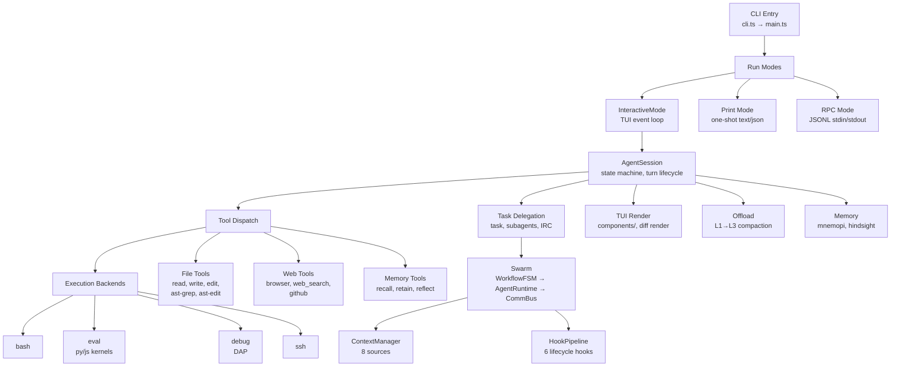

# SatoPi Architecture

SatoPi — multi-agent CLI, fork of [oh-my-pi](https://github.com/can1357/oh-my-pi). `stp` binary (Bun + Rust), 40+ LLM providers, 32 tools, swarm orchestration.

## Package Map

| Package | Description |
|---------|-------------|
| `packages/ai` | Multi-provider LLM client, streaming |
| `packages/catalog` | Model catalog: models.json, provider descriptors |
| `packages/agent` | Agent runtime: tool calling, state management |
| `packages/coding-agent` | Main CLI (**primary focus**) |
| `packages/tui` | Terminal UI, differential rendering |
| `packages/natives` | Native text/image/grep bindings |
| `packages/stats` | Observability dashboard (`stp stats`) |
| `packages/utils` | Logger, streams, temp files |
| `crates/pi-natives` | Rust crate: perf-critical text/grep ops |

## coding-agent Subsystems



## Data Flow

```
User input (CLI args or TUI stdin)
  │
  ▼
cli.ts ── normalize argv, dispatch subcommand
  │
  ▼
main.ts ── load theme, settings, model registry
  │
  ▼
createAgentSession() ── boot AgentSession with tools + hooks
  │
  ├── InteractiveMode: TUI loop → tool dispatch → render
  ├── runPrintMode:     prompt → LLM → stdout
  └── runRpcMode:       JSONL stdin → LLM → JSONL stdout
  │
  ▼
AgentSession turn loop:
  1. Assemble prompt + context (Handlebars .md templates)
  2. Call LLM provider (streaming via packages/ai)
  3. Parse tool calls → dispatch to implementations
  4. Execute tool → capture result/artifacts
  5. Feed result back into conversation
  6. Repeat until model responds with text only
  │
  ▼
Swarm path (optional):
  WorkflowFSM (idle→script→stage→curtain)
    → AgentRuntime.spawn() spawns workers
    → CommBus routes inter-agent messages
    → ContextPipeline assembles per-agent context
    → HookPipeline triggers lifecycle events
```

## Key Files Index

| File | Lines | Purpose |
|------|-------|---------|
| `packages/coding-agent/src/sdk.ts` | 3,282 | AgentSession factory, tool dispatch, modes |
| `packages/coding-agent/src/session/agent-session.ts` | 17,055 | State machine, turn lifecycle, context |
| `packages/coding-agent/src/modes/interactive-mode.ts` | 4,630 | TUI event loop, keybindings |
| `packages/coding-agent/src/tools/read.ts` | 3,613 | File read with selectors, URL resolution |
| `packages/coding-agent/src/task/executor.ts` | 2,799 | Subagent spawn, monitor, results |
| `packages/coding-agent/src/slash-commands/builtin-registry.ts` | 2,743 | Slash-command registry, dispatch |
| `packages/coding-agent/src/session/session-manager.ts` | 2,128 | Persistence, JSONL tree, fork/resume |
| `packages/coding-agent/src/tools/grep.ts` | 1,917 | Content search: regex, glob, pagination |
| `packages/coding-agent/src/main.ts` | 1,549 | CLI boot: theme, settings, model registry |
| `packages/coding-agent/src/swarm/core/workflow-fsm.ts` | 601 | Swarm FSM: phases, guarded transitions |

## Development Quickstart

**Prerequisites:** bun ≥ 1.3.14, Rust nightly-2026-04-29

```sh
git clone https://github.com/VikingShow/SatoPi.git
cd SatoPi
bun setup          # install deps + build Rust native addon + link CLI
```

From `packages/coding-agent/`:

| Task | Command |
|------|---------|
| Typecheck + lint | `bun run check` |
| Types only | `bun run check:types` |
| Lint only | `bun run lint` |
| Tests | `bun run test` |
| Autofix | `bun run fix` |
| Build binary | `bun run build` |

Never `tsc`/`npx tsc` — `bun run check` is the gate.

## Architecture Decisions

- **Bun over Node.** Bun APIs for I/O, SQLite, hashing, spawning. Node `fs/promises` only for dir ops.
- **Barrel re-exports.** `export * from "./module"` over named re-exports.
- **Handlebars prompts.** Static `.md` files; never inline prompt strings.
- **Worker re-entry.** Workers re-enter `cli.ts` via `declareWorkerHostEntry()` → `__stp_worker_*` selectors.
- **Swarm v3 layers.** Six additive layers (WorkflowFSM, AgentRuntime, CommBus, ContextManager, HookPipeline, PhaseBehavior); old APIs delegate internally.
- **Catalog imports.** Values from `@oh-my-pi/pi-catalog/<module>`, never via pi-ai. pi-ai exports only model/effort *types*.
- **No `console.log`.** Use `@oh-my-pi/pi-utils` logger → `~/.stp/logs/`. Prevents TUI corruption.
- **TUI sanitization.** All displayed text: tabs→spaces, truncation, path shortening.
- **Generated models.json.** Never hand-edit. Fix source, run `bun run gen:models`.
- **Zero upstream modifications in swarm.** New swarm code in `swarm/` only; existing APIs unchanged.
