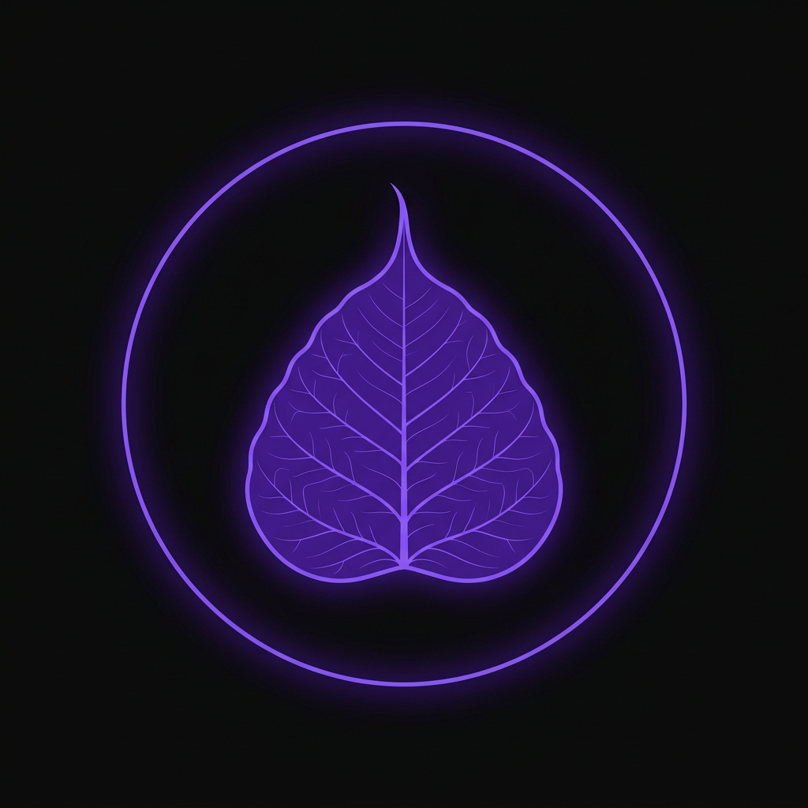

<p align="center">
  
</p>

<p align="center">
  <strong>Satori a team of Pi</strong> — Multi-agent swarm orchestration with roundtable debate.
  &nbsp;·&nbsp; <a href="README-zh.md">中文</a>
</p>

<p align="center">
  <a href="https://github.com/VikingShow/SatoPi/actions/workflows/binary-build.yml"></a>
  <a href="https://github.com/VikingShow/SatoPi/blob/main/LICENSE"></a>
  <a href="https://www.typescriptlang.org"></a>
  <a href="https://www.rust-lang.org"></a>
  <a href="https://bun.sh"></a>
</p>

<p align="center">
  A fork of <a href="https://github.com/can1357/oh-my-pi">oh-my-pi</a> — <em>the most capable agent surface that ships.</em>
</p>

**40+** providers · **32** built-in tools · **14** lsp ops · **28** dap ops · **~55k** lines of Rust core.

## Dev

### Prerequisites

**bun ≥ 1.3.14** · Rust nightly-2026-04-29

### Setup

```sh
git clone https://github.com/VikingShow/SatoPi.git
cd SatoPi
bun setup          # install deps + build Rust native addon + link CLI
```

### stp CLI (from source)

```sh
cd packages/coding-agent
bun src/cli.ts            # interactive TUI
bun src/cli.ts -p "list .ts files"  # one-shot prompt
```

### Build binary

```sh
cd packages/coding-agent
bun scripts/build-binary.ts           # local platform
CROSS_TARGET=linux-x64 bun scripts/build-binary.ts   # cross-compile
# -> dist/stp
```

### Check & Test

```sh
bun check          # TypeScript + Biome + Rust type-check
bun test           # full test suite
bun lint           # lint all
bun fmt            # format all
```

## Install

### Download binary

Pre-built binaries for all platforms from [GitHub Releases](https://github.com/VikingShow/SatoPi/releases):

```sh
# Linux x64
curl -LO https://github.com/VikingShow/SatoPi/releases/latest/download/stp-linux-x64
chmod +x stp-linux-x64 && sudo mv stp-linux-x64 /usr/local/bin/stp

# macOS Apple Silicon
curl -LO https://github.com/VikingShow/SatoPi/releases/latest/download/stp-darwin-arm64
chmod +x stp-darwin-arm64 && sudo mv stp-darwin-arm64 /usr/local/bin/stp

# Windows
curl -LO https://github.com/VikingShow/SatoPi/releases/latest/download/stp-windows-x64.exe
```

### Shell completions

```sh
# zsh
eval "$(stp completions zsh)"

# bash
eval "$(stp completions bash)"

# fish
stp completions fish > ~/.config/fish/completions/stp.fish
```

## SatoPi — Satori a team of Pi

**SatoPi**（悟り + Pi）— *"A team of Pi agents reaching enlightenment through collective deliberation."*

The name captures the moment of **Satori**（悟り）— the Zen sudden awakening — emerging from a **team of Pi** agents converging on truth through structured roundtable debate. Like swarm intelligence crystallizing into insight.

The logo embodies three layers:
- **Circle** — the roundtable（圆桌会议）and the mathematical **π**, the agent runtime at the core
- **Golden ring** — the light of emergent wisdom breaking through
- **Bodhi leaf**（菩提葉）— enlightenment growing from collective deliberation

### The Opera Metaphor

SatoPi models the entire swarm workflow as a **three-act opera**:

```
Script → Stage → Curtain
```

| Act | Phase | What happens |
|-----|-------|--------------|
| **Script** | `script` → `script-debate` → `script-confirm` | Socratic dialogue clarifies the task, then a multi-agent roundtable debate refines the plan into `.stp/plan.md` |
| **Stage** | `stage` ⇄ `paused` / `blocked` | Agents claim tasks from a DAG queue and execute in parallel, coordinated via stigmergy (environment marks) and IRC (direct messaging) |
| **Curtain** | `curtain` → `idle` | Experience extraction, root-cause analysis, and reflection — lessons persist for future runs |

**GraphRunner** (`src/graph/`) is the sole orchestration engine powering the entire lifecycle — DAG scheduling, agent behavior lifecycle, plan validation, and FSM transitions — replacing the earlier fragmented implementation.

## SatoPi Swarm — Development Guide

### Configuration

Edit `.stp/loop.yaml` to configure the swarm:

```yaml
swarm:
  name: SatoPi
  workspace: .
  mode: loop
  agents: {}
  max_iterations: 10

  stage:
    initial: 3
    min: 1
    max: 10
    auto: false
    reviewers: 2

  plan_debate:
    enabled: true
    agent_count: 2
    max_rounds: 2
    convergence_threshold: 0.7
```

### Run a swarm

```sh
stp swarm run .stp/loop.yaml
```

Or from within an interactive session:

```
/swarm run .stp/loop.yaml
```

### Key Files

| File | Purpose |
|------|---------|
| `src/graph/` | GraphRunner orchestration engine + DAG scheduling |
| `src/crew/` | CrewManager + RoundtableSession (agent group chat) |
| `src/context/` | ContextPipeline + offload sources |
| `src/swarm/` | Session management, state machine, prompts |
| `.stp/loop.yaml` | Swarm configuration |
| `.stp/plan.md` | Generated plan from the script phase |
| `.stp/roles/` | Agent role definitions (YAML) |
| `profiles.json` | Persistent agent credit profiles |

## Architecture

```
packages/coding-agent/src/
├── graph/          GraphRunner + DAG orchestration
├── crew/           CrewManager + RoundtableSession
├── context/        ContextPipeline + offload sources
├── swarm/          Session management + state machine + prompts
├── agent/          Agent profiles + role definitions + selection
├── tools/          All 32 built-in tools
├── modes/          TUI + interactive mode
├── task/           Subprocess task executor
├── session/        Agent session management
├── offload/        Context offloading pipeline (L1→L3)
├── coordination/   Stigmergy mark environment
├── experience/     Curtain phase: experience extraction + root-cause analysis
├── comm/           Agent-to-agent communication channels
├── hooks/          Lifecycle hooks + ActivityLogger
└── infra/          Infrastructure: activity logger, MnemoPi, hindsight
```
