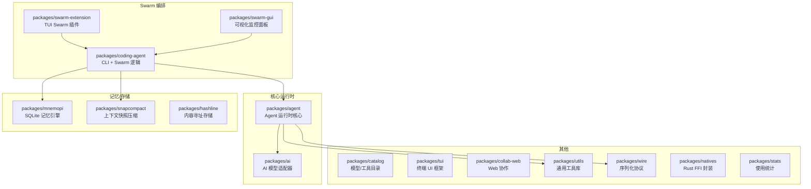
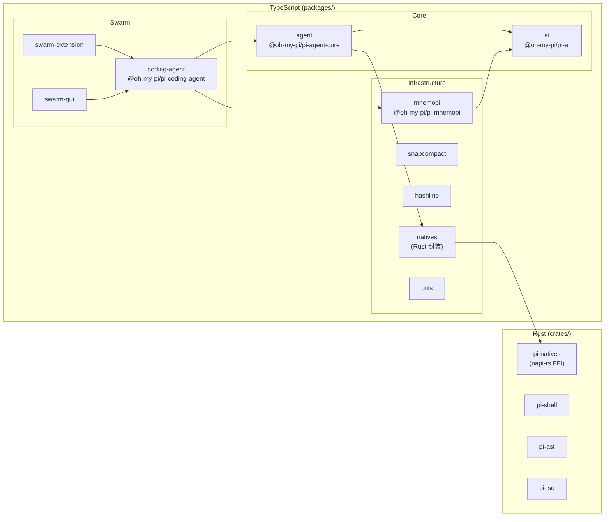

# SatoPi 工程化架构与上下文管理调研报告

> **调研日期**: 2026-07-20（初版）/ 2026-07-20（dev 分支更新）
> **分支**: `dev`（基于 main，17 个提交领先）
> **调研范围**: SatoPi（/root/workspace/SatoPi/）、TencentDB-Agent-Memory（/root/workspace/TencentDB-Agent-Memory/）
> **调研性质**: 只读分析

---

## 0. dev 分支 vs main 分支变更摘要（17 commits, +692/-198 lines）

在初版调研完成后，dev 分支已实施了 **5 个 Phase 的重大重构**，核心变化：

| Phase | 变更 | 影响范围 |
|-------|------|---------|
| **Phase 1** | **ContextGuard 令牌预算守卫**（新增 `context-guard.ts`，119行） | Worker 和 Cloner 的上下文构建前均受控 |
| **Phase 2** | **clonerFeedbackHistory 压缩**（MAX=3 条，溢出合并为 `[compacted]` 前缀） | 解决了跨迭代反馈无限膨胀问题 |
| **Phase 3** | **SwarmSessionManager**（新增 287行），包装 OH-MY-PI SessionManager | `pipeline.json`/`activity.jsonl`/`conversation.json` 三个文件 → 统一 `session.jsonl` |
| **Phase 3-4** | **SessionRegistry 多会话管理**（新增 193行）+ EventBus | 多 swarm 并发运行、会话隔离 |
| **Phase 5** | **前端 GUI 多会话支持** | 对应后端多会话架构 |

**本报告中标注为 🆕 的内容为 dev 分支新增/变更。**

---

## 摘要

SatoPi 是一个基于 oh-my-pi（omp）的多智能体 swarm 编排系统，通过 **Loop Engineering** 机制实现 Worker 并行执行、Cloner Council 审查、计划辩论等复杂的多 Agent 协作。本文系统性梳理了其工程化架构（三层技术栈：Rust/TypeScript/Python）、Swarm 编排核心实现（Loop 三阶段、上下文构建、收敛检测）、oh-my-pi 可复用模块评估（mnemopi/snapcompact/hashline），并与 TencentDB-Agent-Memory 的四层记忆模型进行对比分析，最后提炼可借鉴的改造建议。

**dev 分支已落地的核心改进**: ContextGuard 令牌预算、反馈历史压缩、统一会话持久化（session.jsonl 替代三个独立文件）、多会话隔离架构 —— 这些正是初版分析报告推荐的前 3 个 Phase 改造路径。

---

## 一、工程化架构

### 1.1 项目全貌

SatoPi（"Satori, a Team of Pi"）是 oh-my-pi 的一个 fork，在 omp 的 Agent 运行时基础上扩展了多智能体 swarm 编排能力。项目名蕴含禅宗"顿悟"(Satori) 概念 —— 多个 Pi agent 通过结构化圆桌辩论来收敛到真理。

**基础信息**:

| 属性 | 值 |
|------|-----|
| 包名 | `omp` (private) |
| 版本 | v16.5.0 |
| 许可证 | MIT |
| 包管理器 | Bun >= 1.3.14 |
| Rust 版本 | edition 2024 |
| 代码量 | ~55,000 行 Rust + 大量 TypeScript |
| 主页 | https://omp.sh |

### 1.2 三层技术栈

项目采用 **Rust (crates/) + TypeScript (packages/) + Python (robomp)** 三层架构：

```
                    ┌──────────────────────────────┐
                    │       SatoPi / omp           │
                    │   (Bun workspace root)        │
                    └──────────┬───────────────────┘
                               │
        ┌──────────────────────┼──────────────────────┐
        │                      │                      │
        ▼                      ▼                      ▼
┌───────────────┐   ┌───────────────────┐   ┌──────────────┐
│  Rust Crates  │   │  TS Packages      │   │   Python     │
│  (crates/)    │   │  (packages/)      │   │  (python/)   │
├───────────────┤   ├───────────────────┤   ├──────────────┤
│ pi-ast        │   │ agent (运行时核心) │   │ robomp       │
│ pi-iso        │   │ ai (AI 适配)      │   │ (远程Worker) │
│ pi-natives    │   │ catalog (模型目录) │   │              │
│ pi-shell      │   │ coding-agent (CLI) │   │              │
│               │   │ swarm-extension    │   │              │
│               │   │ swarm-gui (可视化) │   │              │
│               │◄──│ mnemopi (记忆引擎) │   │              │
│ napi-rs FFI ──┼──►│ snapcompact(快照) │   │              │
│               │   │ hashline(寻址存储) │   │              │
│               │   │ utils/wire/...     │   │              │
└───────────────┘   └───────────────────┘   └──────────────┘
```

#### 1.2.1 Rust 层 (crates/)

```toml
# Cargo.toml workspace members
members = ["crates/pi-*", "crates/vendor/*"]
exclude = ["crates/vendor/brush-core", "crates/vendor/brush-builtins"]
```

4 个核心 Rust crate:

| Crate | 职责 | 关键依赖 |
|-------|------|---------|
| **pi-natives** | Node.js FFI 桥接层，通过 napi-rs 导出原生能力 | napi, napi-derive, tokio, tiktoken-rs |
| **pi-shell** | 终端模拟、命令执行（基于 uutils coreutils） | portable-pty, grep-* crates |
| **pi-ast** | 语法树解析（50+ tree-sitter 语法）、代码结构分析 | tree-sitter, ast-grep-core |
| **pi-iso** | 沙箱隔离执行 | — |

Rust 层的关键设计特点：

- **napi-rs 异步桥接**: `pi-natives/src/task.rs` 通过 `Blocking::compute` 包裹异步任务，防止 Rust panic 跨越 FFI 边界导致进程崩溃（`Cargo.toml:28-35` 注释）
- **tree-sitter 50+ 语法**: 支持几乎所有主流编程语言的 AST 解析
- **syntect 语法高亮**: 终端输出着色
- **tiktoken-rs**: 精确 token 计数

#### 1.2.2 TypeScript 层 (packages/)

19 个包，通过 `@oh-my-pi/*` scope 发布：



关键包定位:

| 包 | scope | 职责 |
|----|-------|------|
| `@oh-my-pi/pi-agent-core` | `packages/agent` | Agent 运行时核心：对话循环、工具调用、子进程管理 |
| `@oh-my-pi/pi-coding-agent` | `packages/coding-agent` | CLI 入口 + Swarm 编排核心(`src/swarm/`) |
| `@oh-my-pi/pi-mnemopi` | `packages/mnemopi` | 本地记忆引擎，158+ API 方法 |
| `@oh-my-pi/pi-ai` | `packages/ai` | LLM Provider 统一适配（OpenAI/Anthropic/本地） |
| `@oh-my-pi/snapcompact` | `packages/snapcompact` | 上下文增量快照 + 差分压缩 |
| `@oh-my-pi/hashline` | `packages/hashline` | Git-like 内容寻址行级存储 |

#### 1.2.3 Python 层 (python/robomp/)

- **robomp**: 远程 Worker 池，支持在 Docker 容器中并行运行 Agent
- 作为 omp 的远程执行后端，Worker 通过 RPC 接收任务

### 1.3 模块依赖关系



**关键依赖关系解读**:

1. **`natives` → `pi-natives`**: TypeScript 通过 napi-rs 调用 Rust 原生能力（token 计数、AST 解析、grep 搜索等）
2. **`coding-agent` → `agent`**: Swarm 编排通过 `runSubprocess()` 调用 Agent 运行时，以子进程形式执行每个 Worker/Cloner
3. **`coding-agent` → `mnemopi`**: 复用 mnemopi 的记忆 API，但当前仅在全局 session 级别使用，Swarm 循环内部未深度集成
4. **`swarm-extension` → `coding-agent`**: TUI 插件通过注册命令接口调用 Swarm 编排逻辑

### 1.4 运行时配置层

SatoPi 有两级运行时配置：

#### `.omp/` — Oh-My-Pi 配置

```
.omp/
├── agents/                    # Agent 定义（YAML）
│   ├── before-loop/           #   Before-loop 阶段的 agent（socrates.md 等）
│   └── ...                    #
├── skills/                    # 技能定义
├── models.yaml                # 模型配置
└── ...
```

#### `.swarm-workspace/` — Swarm 工作区

```
.swarm-workspace/
├── loop.yaml                  # ★ Swarm Loop 配置（核心）
├── roles/                     # Cloner 角色定义（guardian/adversarial/...）
├── state/                     # 状态跟踪（pipeline.json, agent states）
└── activity/                  # 活动日志
```

`loop.yaml` 是 Swarm 的顶层配置，定义：
- `mode`: pipeline | sequential | parallel | loop
- `workers`: Worker agent IDs、round 配置、收敛参数
- `cloners`: Cloner agent IDs、审查角色、加权投票
- `plan_debate`: Before-loop 计划辩论配置
- `debate`: In-loop 辩论（deliberation）配置
- `agentRestrictions`: 工具权限控制

---

## 二、Swarm 编排实现详解

### 2.1 核心文件清单

| 文件 | 行数 | 职责 |
|------|------|------|
| `packages/coding-agent/src/swarm/loop-controller.ts` | ~1553 | LoopController: Swarm 主循环调度器 |
| `packages/coding-agent/src/swarm/roundtable.ts` | ~400 | ClonerCouncil: Cloner 圆桌审查 + 加权投票 |
| `packages/coding-agent/src/swarm/cloner-roundtable.ts` | ~350 | ClonerRoundtable: 计划阶段 Cloner 辩论 |
| `packages/coding-agent/src/swarm/schema.ts` | ~200 | LoopSwarmConfig Zod schema |
| `packages/coding-agent/src/swarm/worker-channel.ts` | ~200 | WorkerChannel: IRC 通讯 + 提名/选举 |
| `packages/coding-agent/src/swarm/file-tracker.ts` | ~300 | FileTracker: 文件变更追踪 + 冲突检测 |
| `packages/coding-agent/src/swarm/region-lock.ts` | ~150 | RegionLockManager: 文件区域锁（并发写入保护） |
| `packages/coding-agent/src/swarm/state.ts` | ~200 | StateTracker: 管道状态持久化 |
| `packages/coding-agent/src/swarm/activity-logger.ts` | ~150 | ActivityLogger: 活动日志 + SSE 推送 |
| `packages/coding-agent/src/swarm/task-analyzer.ts` | ~100 | TaskComplexityAnalyzer: 任务复杂度分析 |
| `packages/coding-agent/src/swarm/verification-hook.ts` | ~80 | VerificationHook: 后置验证钩子 |

### 2.2 YAML 配置驱动机制

Swarm 通过 `LoopSwarmConfig` (Zod schema) 进行声明式配置，类型定义在 `schema.ts`：

```typescript
// schema.ts 核心类型
interface LoopSwarmConfig {
  mode: "pipeline" | "sequential" | "parallel" | "loop";
  workers: {
    agents: string[];           // Worker agent ID 列表
    maxRounds: number;          // 每迭代最多执行轮次
    convergenceNeeded: number;  // 连续收敛所需轮次数
    roundtablePrompt?: string;  // 每轮 cross-examination prompt
  };
  cloners: {
    agents: string[];           // Cloner agent ID 列表
    approvalThreshold: number;  // 批准阈值（0-1）
    deliberation?: boolean;     // 是否启用交叉审查
    roles?: Record<string, RoleAsset>; // P0-D 角色分配
  };
  debate?: {
    enabled: boolean;
    maxRounds: number;          // 辩论最多子轮次（默认2）
  };
  plan_debate?: {
    enabled: boolean;
    maxRounds: number;
    convergenceThreshold: number; // Jaccard 阈值
  };
  agentRestrictions?: Record<string, AgentToolRestriction>;
  verification?: { command: string };
}
```

### 2.3 Loop 模式三阶段完整流程

```
┌──────────────────────────────────────────────────────────────┐
│                    LOOP ENGINEERING                          │
│                                                              │
│  ┌──────────────┐   ┌──────────────┐   ┌──────────────┐     │
│  │ BEFORE LOOP  │──▶│   IN LOOP    │──▶│ AFTER LOOP   │     │
│  │  (Planning)  │   │ (Execution)  │   │(Experience)  │     │
│  └──────────────┘   └──────────────┘   └──────────────┘     │
└──────────────────────────────────────────────────────────────┘
```

#### Phase 1: Before Loop（计划阶段）

由 `/loopeng` 命令触发，`before-loop-manager.ts` 实现：

```
用户输入 /loopeng
    │
    ├── Step 1: Socrates 对话
    │   └── .omp/agents/before-loop/socrates.md 驱动
    │       逐轮提问 → 逐步填充 plan.md
    │       问题覆盖: 功能需求 / 非功能需求 / 边界条件 / 依赖 / 约束
    │       终止条件: 覆盖率 >= 90% AND 无未解决歧义
    │
    ├── Step 2: Cloner Roundtable 辩论（若 plan_debate.enabled）
    │   ├── 2+ Cloner 实例并行读取 plan.md 草稿
    │   ├── Round 1: 各自独立评审，提出挑战
    │   ├── Round 2+: 交叉审查 peer 意见
    │   ├── 收敛检测: Jaccard(round_n, round_n-1) >= convergence_threshold
    │   │             连续 convergence_threshold 轮 → 收敛
    │   └── 产出: 精炼后的 plan.md
    │
    ├── Step 3: 人工确认
    │   └── 用户审查并确认最终 plan.md
    │
    └── Step 4: TaskComplexityAnalyzer（若 workers.auto）
        └── 读取 plan.md → 动态推荐 worker/cloner 数量
```

#### Phase 2: In Loop（执行阶段）

核心循环在 `LoopController.runLoop()` (loop-controller.ts: ~530-1200):

```
for iteration in 0..maxIterations:
    │
    ├── 1. Worker 并行执行 (maxRounds 轮)
    │   ├── Round 0: Worker 携带 plan.md + cloner feedback 执行
    │   │   └── 输出: 文件变更 + ## Round Summary
    │   ├── Round 1+: Worker 接收前轮输出 + 文件冲突报告
    │   │   ├── extraContext = 冲突报告 + roundtablePrompt + priorOutputs
    │   │   └── Deliberation 阶段（若 debate.enabled）
    │   │       ├── Sub-round 1 (CHALLENGE): 读 peers 输出，发送 IRC 挑战
    │   │       ├── Sub-round 2 (REBUTTAL): 读挑战，回应或修复
    │   │       └── Sub-round 3 (RESOLUTION): Reviewer 裁决或投票
    │   │
    │   ├── 每轮后: extractRoundSummary() → priorOutputs
    │   ├── Nomination: Worker 提名 Reviewer
    │   └── 收敛检测:
    │       ├── 若有 Reviewer: 解析 ## RoundSummary JSON
    │       └── 否则: Jaccard 文本相似度 >= 阈值
    │
    ├── 2. FileTracker.endRound() → 冲突检测
    │   └── 重叠写入检测 (severity: "overlap")
    │
    ├── 3. Workers 内部收敛?
    │   ├── YES → VerificationHook → 返回 "completed"
    │   └── NO  → 进入 Cloner Council
    │
    ├── 4. Cloner Council 审查
    │   ├── 并行启动 Cloner 子进程
    │   ├── 每个 Cloner 独立审查 workerOutput（截断至 4000 字符/Worker）
    │   ├── 返回 JSON: {verdict, confidence, findings, worker_count_delta, ...}
    │   ├── P0-D 加权投票 (clonerRoles):
    │   │   ├── adversarial / security → 否决权（单个 FAIL = 推翻全部）
    │   │   └── guardian / architecture → 标准权重
    │   ├── 若 FAIL + disagreed + deliberation 启用 → 交叉审查轮
    │   └── Verdict PASS?
    │       ├── YES → VerificationHook → "completed"
    │       └── NO  → 继续下一迭代
    │
    └── 5. 收敛停滞检测
        └── Jaccard >= 0.8 持续 → stagnationCount++
            └── >= maxStagnation → 触发 BlockerContext 等待人工决策
```

#### Phase 3: After Loop（经验阶段）

执行完成后生成经验总结，写入 `.swarm_loop-engineering/` 目录。

### 2.4 Worker 上下文构建策略（详细）

`#spawnWorkers()` 方法位于 `loop-controller.ts:1220-1313`，是理解 Swarm 上下文管理的核心入口：

```typescript
// loop-controller.ts:1260-1272
runSubprocess({ cwd: workspace, agent: agentDef, task: [
    `You are Worker ${i + 1} of ${workerIds.length}.`,
    `Your peers are: ${workerIds.filter(w => w !== id).join(", ")}.`,
    `Negotiate with them via IRC (use \`irc send to:worker:*\` for broadcast).`,
    `Work in the workspace: ${workspace}.`,
    planContent ? `\n## Plan\n\n${planContent}` : "",          // ← plan.md 全文
    feedbackBlock,                                               // ← 历史 Cloner 反馈
    roleSuggestions?.[id]
        ? `\n## Role\n\nCloner review suggests your role for this round: **${roleSuggestions[id]}**.\n`
        : "",
    nominationPrompt ?? "",                                      // ← Reviewer 提名指引
    extraContext ?? "",                                          // ← 前轮输出 + 冲突报告
].join("\n"),
```

**上下文构建规则表**:

| 上下文组成部分 | 来源 | 何时注入 | 截断策略 |
|--------------|------|---------|---------|
| `WORKER_SYSTEM_PROMPT` | 常量（122-208行） | 每次 Worker 启动 | 无截断（约 2000 字符） |
| `planContent` | Before-loop 生产的 plan.md | 每次 Worker 启动 | 无截断（plan.md 全文） |
| `feedbackBlock` | `previousFeedback` 数组 | 有历史反馈时 | 每条反馈完整保留 |
| `roleSuggestions` | Cloner 审查产出 | Round 2+ 且 Cloner 建议了角色 | 无截断 |
| `nominationPrompt` | WorkerChannel 生成 | 每轮（用于选举 Reviewer） | 无截断 |
| `extraContext` | `priorOutputs` + `conflictReport` | Round 1+ | **仅保留 Round Summary** (extractRoundSummary, 254-257行) |

**Round Summary 提取机制** (`loop-controller.ts:254-257`):

```typescript
function extractRoundSummary(output: string): string {
    const match = output.match(/## Round Summary\n([\s\S]*?)(?=\n## |\n```|\n---\n|---|\n\*\*\*|\n___|$)/);
    return match?.[1]?.trim() || output.slice(0, 2000);  // 回退: 前 2000 字符
}
```

这是 Swarm 最关键的上下文压缩机制：**Worker 的完整输出中，只有 `## Round Summary` 部分被传递给下一轮**。如果 Worker 未输出该段，则回退到截取前 2000 字符。

**extraContext 拼接逻辑** (`loop-controller.ts:577-589`):

```typescript
let extraContext = "";
if (round > 0 && lastConflictReport) {
    const conflictText = FileTracker.formatConflictReport(lastConflictReport);
    if (conflictText) { extraContext = `${conflictText}\n\n`; }
}
if (round > 0) {
    const prompt = this.#loopConfig.workers.roundtablePrompt
        ? `\n${this.#loopConfig.workers.roundtablePrompt}\n`
        : `\n## Prior Round Outputs\n\nCross-examine these outputs...\n`;
    extraContext = `${extraContext}${prompt}\n${priorOutputs}`;
}
```

其中 `priorOutputs` 的构建 (`loop-controller.ts:639-642`):

```typescript
priorOutputs = roundResults
    .filter(r => !r.output.startsWith("[CRASHED]"))
    .map(r => `[${r.agent}]\n${extractRoundSummary(r.output)}`)
    .join("\n\n---\n\n");
```

### 2.5 Cloner Council 审查机制

`ClonerCouncil.review()` 在 `roundtable.ts:70-149` 实现：

```
并行启动 N 个 Cloner 子进程
    │
    ├── 每个 Cloner 接收:
    │   ├── workerOutput（每个 Worker 输出截断至 4000 字符）
    │   ├── planContent（plan.md 全文）
    │   ├── previousFindings（历史发现，防止重复标记）
    │   └── Review Prompt（要求返回 JSON）
    │
    ├── 解析 JSON 输出: {verdict, confidence, findings, worker_count_delta, role_suggestions, ...}
    │
    ├── P0-D 加权投票:
    │   ├── adversarial / security: 否决权（单个 FAIL = 全部推翻）
    │   └── 其他角色: 标准权重
    │
    ├── 若 FAIL + disagreed:
    │   └── 可选 cross-examination deliberation round
    │
    └── 返回 ReviewVerdict
```

**角色定义** (.swarm-workspace/roles/):
- **guardian**: 质量守护，侧重功能完整性
- **adversarial**: 对抗性审查，刻意找漏洞（否决权）
- **security**: 安全审查，关注注入/CVE/权限（否决权）
- **performance**: 性能审查，关注复杂度/瓶颈
- **architecture**: 架构审查，关注设计一致性

### 2.6 收敛检测算法

Swarm 使用两种收敛检测机制：

**A. Reviewer 结构化的 RoundSummary JSON** (loop-controller.ts:646-693):
```
若 Round > 0 AND convergenceNeeded > 0:
    ├── 优先尝试解析 Reviewer 的 RoundSummary JSON
    │   └── 包含 convergence_opinion: "converging" | "diverging" | "stalled"
    └── 回退: Jaccard 文本相似度
```

**B. Jaccard 相似度** (loop-controller.ts:275-280):
```typescript
function jaccardSimilarity(a: string[], b: string[]): number {
    const setA = new Set(a);
    const setB = new Set(b);
    if (setA.size === 0 && setB.size === 0) return 1;
    let intersection = 0;
    for (const item of setA) { if (setB.has(item)) intersection++; }
    return intersection / (setA.size + setB.size - intersection);
}
```

**Cloner 审查停滞检测**:
- Jaccard(finding_n, finding_n-1) >= 0.8 → stagnationCount++
- stagnationCount >= maxStagnation → 阻塞，等待人工决策

### 2.7 工具级安全控制

Swarm 实现了三层工具安全管控：

| 层级 | 机制 | 实现位置 |
|------|------|---------|
| **配置层** | `agentRestrictions` 白名单/黑名单 | schema.ts → `resolveToolRestrictions()` |
| **锁协调层** | RegionLockManager 文件区域锁 | `#buildLockHooks()` (1317-1387行) |
| **辩论约束层** | Deliberation 阶段锁定 write/edit/bash | `#runDeliberationPhase()` (1409-1419行) |

```typescript
// Deliberation 阶段工具限制 (loop-controller.ts:1409-1419)
const EDIT_TOOLS = new Set(["edit", "write", "bash"]);
const deliberationHooks = {
    beforeToolCall: ctx => {
        if (EDIT_TOOLS.has(ctx.toolCall.name)) {
            return { block: true, reason: "Deliberation phase: write/edit/bash blocked. Use IRC to debate." };
        }
        return undefined;
    },
};
```

### 2.8 Deliberation（辩论）阶段

`#runDeliberationPhase()` (loop-controller.ts:1396-1479):

```
for sub in 0..maxSubRounds:
    ├── Sub-round 1 (CHALLENGE):
    │   └── 每个 Worker 读到所有 peer 输出 → 发送 IRC CHALLENGE
    │
    ├── Sub-round 2 (REBUTTAL):
    │   └── Worker 读到对自己的挑战 → 回应 REBUTTAL 或 DISAGREE
    │
    └── Sub-round 3 (RESOLUTION):
        └── Reviewer 发布 RULING 或多数投票决议
```

上下文构建:
```typescript
task: [
    `## ${subLabel} Phase`,
    sub === 0 ? "Read ALL peer outputs..." : sub === 1 ? "Read challenges..." : "Review all rebuttals...",
    planContent ? `\n## Plan\n\n${planContent}` : "",
    `\n## Peer Outputs (Round)\n\n${allOutputs}`,           // 所有 peer 输出 (各截断至 4000 字符)
    `\n## Your Previous Output\n\n${currentOutputs.find(r => r.agent === id)?.output.slice(0, 3000)}`,
].join("\n"),
```

### 2.9 上下文管理的核心缺陷

通过对上述实现的分析，可以识别出 Swarm 上下文管理的五个核心局限性：

| # | 问题 | 影响 | 代码依据 |
|---|------|------|---------|
| 1 | **无持久化记忆** | 跨迭代之间没有记忆存储，完全靠 priorOutputs + feedbackBlock 拼接 | `#spawnWorkers()` 1260-1272 行，所有上下文均为临时变量 |
| 2 | **纯字符串拼接** | 上下文由 `.join("\n")` 拼接，无 token 预算控制 | `task: [...]join("\n")` 模式在多处使用 |
| 3 | **粗粒度截断** | Round Summary 回退机制简单（2000 字符截断），无智能压缩 | `extractRoundSummary()` 254-257 行回退逻辑 |
| 4 | **无上下文分层** | plan / feedback / prior outputs 全部平铺在同一层级 | 所有上下文部分平级注入 |
| 5 | **无跨 session 记忆** | 每次 Swarm run 独立，不积累历史经验 | 无任何持久化存储 api 调用 |


---

## 三、oh-my-pi 可复用模块评估

### 3.1 Mnemopi — 本地记忆引擎

**包**: `@oh-my-pi/pi-mnemopi` v16.5.0  
**路径**: `packages/mnemopi/src/core/`

#### 核心架构

```
┌──────────────────────────────────────┐
│           Mnemopi (Facade)           │
│  remember / recall / sleep / getContext │
└──────────────┬───────────────────────┘
               │
┌──────────────▼───────────────────────┐
│           BeamMemory (Engine)        │
│  ┌─────────────┐ ┌────────────────┐  │
│  │ Working     │ │ Episodic       │  │
│  │ Memory      │ │ Memory         │  │
│  │ (热存储)     │ │ (冷存储, 3-tier) │  │
│  └─────────────┘ └────────────────┘  │
│  ┌────────────────────────────────┐  │
│  │  SQLite + FTS5 + Vector Store  │  │
│  └────────────────────────────────┘  │
└──────────────┬───────────────────────┘
               │
┌──────────────▼───────────────────────┐
│         EpisodicGraph (可选)         │
│  Gist 提取 / Fact 三元组 / 图链接    │
└──────────────────────────────────────┘
```

#### 能力矩阵

| 能力 | API | 状态 | Swarm 可复用性 |
|------|-----|------|--------------|
| **Hybrid 搜索** | `recall(query, opts)` → 向量+FTS+重要性 | 生产就绪 | ★★★★★ 替代 priorOutputs 字符串拼接 |
| **记忆存储** | `remember(content, opts)` | 生产就绪 | ★★★★★ 持久化 Worker 输出 |
| **记忆更新** | `updateWorking(id, content)` | 生产就绪 | ★★★★☆ 更新迭代中的上下文 |
| **批处理** | `rememberBatch(items, opts)` | 生产就绪 | ★★★★★ 批量写入多 Worker 输出 |
| **Consolidation** | `sleep()`, `sleepAllSessions()` | 生产就绪 | ★★★★☆ 迭代结束后整理记忆 |
| **退化管理** | `degradeEpisodic()` (3-tier) | 生产就绪 | ★★★☆☆ 长期记忆管理 |
| **Scratchpad** | `scratchpadWrite/Read/Clear()` | 生产就绪 | ★★★★★ 替代临时变量传递 |
| **上下文获取** | `getContext(limit)` | 生产就绪 | ★★★★★ 替代 priorOutputs 拼接 |
| **事实提取** | `extractAndStoreFacts()` + EpisodicGraph | 生产就绪 | ★★★★☆ 自动提取跨迭代知识 |
| **嵌入模型** | 16+ 模型 (BGE/E5/OpenAI/Jina/本地 ONNX) | 生产就绪 | ★★★★★ 可复用的向量化能力 |
| **MMR 重排** | 内置 Maximal Marginal Relevance | 生产就绪 | ★★★★☆ 去重 + 多样性保证 |
| **多 Bank** | `setBank(name)` 隔离存储 | 生产就绪 | ★★★★☆ 按 session 隔离 Swarm 记忆 |

#### SQLite Schema 摘要

```sql
-- working_memory: 25+ 列
CREATE TABLE working_memory (
    id TEXT PRIMARY KEY,
    content TEXT NOT NULL,
    author_id TEXT,
    author_type TEXT,
    channel_id TEXT,
    session_id TEXT,
    importance REAL DEFAULT 0.5,
    veracity TEXT DEFAULT 'unverified',
    trust_tier TEXT,
    memory_type TEXT,
    scope TEXT,
    timestamp INTEGER,
    valid_until INTEGER,
    metadata TEXT,       -- JSON
    embedding BLOB,
    ...
);

-- FTS5 全文索引
CREATE VIRTUAL TABLE fts_working USING fts5(content, content=working_memory, ...);

-- episodic_memory: 3-tier 退化
CREATE TABLE episodic_memory (
    id TEXT PRIMARY KEY,
    tier INTEGER DEFAULT 1,       -- 1=fresh, 2=30d, 3=180d+compressed
    binary_vector BLOB,
    ...
);
```

### 3.2 Snapcompact — 上下文快照压缩

**包**: `@oh-my-pi/snapcompact` v16.5.0  
**路径**: `packages/snapcompact/`

#### 核心能力

- **增量快照**: 仅存储变化的部分，差异编码
- **差分压缩**: 两快照之间只存储 diff
- **解压重建**: 从快照序列完整重建上下文

#### Swarm 可复用性评估: ★★★☆☆

| 潜力 | 限制 |
|------|------|
| 可用于压缩 Worker 输出，减少上下文体积 | API 相对底层，需要适配层 |
| 增量快照适合跨迭代的上下文变更追踪 | 当前主要用于 agent 对话历史快照 |
| 可以作为 `extraContext` 的压缩器 | Swarm 当前无快照概念，集成成本较高 |

### 3.3 Hashline — 内容寻址存储

**包**: `@oh-my-pi/hashline` v16.5.0  
**路径**: `packages/hashline/`

Git-like 内容寻址行级存储，按内容哈希索引。目前主要用于代码 snip 的精确去重。

#### Swarm 可复用性评估: ★★☆☆☆

在当前 Swarm 架构中直接复用价值有限，但如果未来需要**精确复用跨 run 的文件内容**，可以作为去重存储后端。

### 3.4 复用潜力总结

```
可复用模块                  当前 Swarm 集成状态        建议集成深度
─────────────────────────────────────────────────────────────────
mnemopi (记忆引擎)          部分使用（全局 session）    ★★★★★ 深度集成
  ├─ recall()               未使用                     替代 priorOutputs 构建
  ├─ remember()             未使用                     持久化 Worker 产出
  ├─ getContext()           未使用                     结构化上下文构建
  ├─ scratchpad             未使用                     替代临时变量
  └─ embedding providers    未使用                     为 Swarm 上下文加向量索引

snapcompact (快照压缩)       未使用                     ★★★☆☆ 有条件集成
  └─ 差分快照                未使用                     压缩跨迭代上下文

hashline (寻址存储)          未使用                     ★★☆☆☆ 远期可选

pi-ai (LLM 适配器)          已集成                     无需修改
pi-utils (工具库)           已集成                     无需修改
```

---

## 四、TencentDB-Agent-Memory 对比分析

### 4.1 项目概述

**TencentDB Agent Memory** (`@tencentdb-agent-memory/memory-tencentdb` v0.3.6) 是为 AI Agent（OpenClaw / Hermes）设计的四层生产级记忆系统，TypeScript 实现，Node.js >= 22.16.0。

**核心理念**: "Memory is not about hoarding everything in the AI — it is about sparing humans from having to repeat themselves."

### 4.2 四层记忆模型（L0-L3）

```
┌────────────────────────────────────────────────────────┐
│                    SEMANTIC PYRAMID                      │
│                                                          │
│  L3 ┌──────────┐    Persona（用户画像）                   │
│     │ persona.md│    单一 Markdown 文件                   │
│     └──────────┘                                        │
│          ▲ 索引映射（100% 可溯源）                        │
│  L2 ┌──────────────┐  Scenario（场景块）                  │
│     │ scene_blocks/ │  *.md 文件，LLM Agent 自维护        │
│     └──────────────┘  + .metadata/scene_index.json       │
│          ▲                                               │
│  L1 ┌──────────────┐  Atom（结构化事实）                  │
│     │ memories.jsonl│  Persona / Episodic / Instruction    │
│     └──────────────┘  LLM 提取 → Dedup → 向量索引        │
│          ▲                                               │
│  L0 ┌──────────────────────┐  Conversation（原始对话）    │
│     │ conversations/         │  按天分片 JSONL             │
│     │   YYYY-MM-DD.jsonl    │  SQLite FTS5 + 向量         │
│     └──────────────────────┘                             │
└────────────────────────────────────────────────────────┘
```

**分层溯源机制**: L3 → L2 → L1 → L0，任何高层摘要都能通过索引映射精确追溯回底层原始对话。

### 4.3 Recall 机制 — 上下文注入

**文件**: `src/core/hooks/auto-recall.ts`

Recall 在 `before_prompt_build` 钩子中触发，返回两部分上下文：

#### appendSystemContext（System Prompt 尾部 — 稳定、可缓存）

```
<user-persona>         ← L3 Persona（persona.md，strip scene navigation）
</user-persona>

<scene-navigation>     ← L2 Scene Index（按 heat 降序，含文件绝对路径）
</scene-navigation>

<memory-tools-guide>   ← 工具调用指南（3 次/轮限额）
</memory-tools-guide>
```

这些内容变化频率低，放在 system prompt 尾部利用 **prompt caching**。

#### prependContext（User Prompt 前缀 — 动态、每轮变化）

```
<relevant-memories>
- [persona] 用户叫王小明...
- [episodic|旅行计划] 用户计划五月去日本旅行...
- [instruction] 用户要求回答时使用中文...
</relevant-memories>
```

L1 记忆搜索结果，每轮不同，放在 user prompt 前缀**不破坏 system prompt cache**。

#### 三种搜索策略

| 策略 | 实现 | 说明 |
|------|------|------|
| `keyword` | FTS5 BM25 | SQLite 全文索引 |
| `embedding` | 向量余弦相似度 | 需 embeddingService + vectorStore |
| `hybrid` (默认) | RRF (k=60) | 并行 keyword + embedding，合并排序 |

**安全机制**:
- `recall.timeoutMs`(5000ms) 超时保护，超时则跳过注入不阻塞对话
- `maxTotalRecallChars` 限制注入字符总量
- `tdai_memory_search` / `tdai_conversation_search` 工具让 Agent 主动按需索取

### 4.4 Capture 机制 — 记忆记录

**文件**: `src/core/hooks/auto-capture.ts`

Capture 在 `agent_end` 触发，三步原子流程：

```
agent_end
    │
    ├── 1. L0 Recording (原子操作，文件锁保护)
    │   ├── 增量提取新消息（checkpoint cursor + position slice）
    │   ├── 污染替换（将注入上下文污染的用户消息替换回原始文本）
    │   ├── sanitizeText() → stripCodeBlocks() → shouldCaptureL0()
    │   └── 写入 conversations/YYYY-MM-DD.jsonl
    │
    ├── 2. L0 Vector Indexing
    │   ├── Path A (SQLite): 先写 metadata + FTS，后台异步 embedding
    │   └── Path B (VDB): 同步 embedding 一次性写入
    │
    └── 3. Scheduler Notification
        └── 通知 MemoryPipelineManager 递增计数，评估 L1 触发条件
```

### 4.5 Pipeline 调度机制

**文件**: `src/utils/pipeline-manager.ts`

```
    L0 Capture
        │
        ▼
    ┌─── L1 触发 ───┐
    │ A. 对话阈值     │  warm-up: 1→2→4→...→everyNConversations
    │ B. 空闲超时     │  session 空闲 l1IdleTimeoutSeconds(600s)
    │ C. 关闭刷新     │  优雅关闭时 flush
    └──────┬─────────┘
           │
           ▼
    ┌─── L2 触发 ───┐
    │ A. L1 完成后延迟│  max(now + l2DelayAfterL1, lastL2 + l2MinInterval)
    │ B. 最大间隔保证 │  now + l2MaxInterval (session 活跃中)
    │ C. 关闭刷新     │
    └──────┬─────────┘
           │
           ▼
    ┌─── L3 触发 ───┐
    │ A. L2 完成后    │  全局互斥锁 (concurrency=1)
    │ B. triggerEveryN │ persona.triggerEveryN(50) 条新记忆
    │ C. L2 信号      │  PERSONA_UPDATE_REQUEST
    └────────────────┘
```

### 4.6 Scene Navigation — 渐进式披露

这是 TencentDB Memory 最精妙的设计之一：

```
Recall 时注入 scene navigation
    ↓
Agent 看到 "目录" (场景名 + 摘要 + 文件路径)
    ↓
Agent 根据需要 read_file(scene_blocks/xxx.md)   ← 按需下钻
    ↓
获取完整场景详情
```

这种**渐进式披露**避免了把大量历史上下文一次性注入 prompt，而是给 Agent 一个"索引"，让它自己决定何时深入。

### 4.7 Persona 系统

- **首次生成** (`first` mode): 从所有场景全面分析用户特征
- **增量更新** (`incremental` mode): 仅分析自上次 persona 以来变化的场景
- **与 Scene Navigation 分离**: persona 主体（change-slow，cache-friendly）+ 独立 navigation 附录（change-fast）

### 4.8 与 SatoPi Swarm 的方案差异对比

| 维度 | SatoPi Swarm 当前 | TencentDB-Agent-Memory | 差异评述 |
|------|-------------------|------------------------|---------|
| **记忆模型** | 无分层，全部平铺 | L0-L3 四层语义金字塔 | Swarm 全部上下文在一层，没有语义提炼 |
| **持久化** | 仅 `state.ts` 持久化 pipeline 状态 | 全层持久化（JSONL + SQLite + Markdown） | Swarm 无跨 run 记忆 |
| **Recall 注入** | 字符串拼接 `.join("\n")` | 分层注入：动态→user prefix，稳定→system suffix | Swarm 无动态/静态分离，无法利用 prompt caching |
| **Token 预算** | 无显式控制 | `maxCharsPerMemory` + `maxTotalRecallChars` + `timeoutMs` | Swarm 完全依赖 LLM 自身的 context window 限制 |
| **压缩策略** | Round Summary 提取（254-257行） | 三阶段：LLM 提取 → Dedup → scene 块管理 | Swarm 压缩为单层正则提取，TencentDB 为多层语义压缩 |
| **工具集成** | IRC Worker 通讯 | memory_search / conversation_search 工具 | TencentDB 让 Agent 主动检索记忆 |
| **会话隔离** | 无（全局 workspace） | sessionKey 维度隔离 | Swarm 无法同时管理多个独立 session |
| **可溯源性** | 无 | L3→L2→L1→L0 完整索引链 | Swarm 的 priorOutputs 丢失原始上下文 |
| **白盒可调试** | swarms 日志为临时文件 | scene_blocks/*.md / persona.md / JSONL 人类可读 | TencentDB 的关键中间产物可直接用编辑器查看 |
| **Host 无关** | 依赖 omp 运行时 | HostAdapter 接口解耦 | TencentDB 可独立部署 |

### 4.9 关键设计原则对比

| 原则 | SatoPi Swarm | TencentDB Memory |
|------|-------------|-----------------|
| **分层不可逆溯源** | ❌ 不适用 | ✅ L3↔L2↔L1↔L0 |
| **渐进式披露** | ❌ 一次注入全部 priorOutputs | ✅ Scene Navigation 按需下钻 |
| **白盒可调试** | ⚠️ 部分（日志文件） | ✅ 全链人类可读 |
| **Prompt Caching 优化** | ❌ 无静态/动态分离 | ✅ system suffix + user prefix |
| **超时保护** | ❌ 无 | ✅ recall.timeoutMs(5000ms) |

---

## 五、可借鉴建议

### 5.1 可立即采纳的设计

#### 5.1.1 分层上下文注入（Prompt Caching 优化）

**现状**: Swarm 的 `WORKER_SYSTEM_PROMPT` (2000+ 字符) 和 `planContent` 每轮都被注入，但它们在单次 run 中是不变的。

**改造**: 借鉴 TencentDB 的静态/动态分离策略：

```
SYSTEM PROMPT (稳定，可缓存):           USER PROMPT (动态，每轮变化):
┌──────────────────────────┐          ┌──────────────────────────┐
│ WORKER_SYSTEM_PROMPT     │          │ 本轮 task description     │
│ planContent (plan.md)    │          │ feedbackBlock            │
│ role definition          │          │ roleSuggestions          │
│                          │          │ nominationPrompt         │
│                          │          │ extraContext (priorOutputs)│
└──────────────────────────┘          └──────────────────────────┘
```

**代码改造位置**: `loop-controller.ts:1248-1272` 的 `runSubprocess` 调用处。

**改造难度**: ★☆☆☆☆（仅需调整 prompt 组装逻辑）

#### 5.1.2 Token 预算守卫

**现状**: Swarm 完全没有任何 token 预算控制。Worker priorOutputs 随着迭代次数增长可能突破 LLM 限制。

**改造**:

```typescript
// 伪代码：在 #spawnWorkers 前添加守卫
function countTokens(text: string): number {
    return this.#tokenCounter.count(text); // 使用 pi-natives 的 tiktoken-rs
}

const MAX_TOKENS = 128_000; // 留 72K 给输出
const WARN_THRESHOLD = 96_000;

const fullContext = task.join("\n");
const tokenCount = countTokens(fullContext + systemPrompt);
if (tokenCount > MAX_TOKENS) {
    throw new Error(`Context too large: ${tokenCount}/${MAX_TOKENS} tokens`);
}
if (tokenCount > WARN_THRESHOLD) {
    logger.warn(`Context approaching limit: ${tokenCount}/${MAX_TOKENS} tokens`);
}
```

**改造位置**: `loop-controller.ts:1260` 前（`runSubprocess` 调用前）

**改造难度**: ★☆☆☆☆（pi-natives 已内置 tiktoken-rs）

#### 5.1.3 Round Summary 智能压缩

**现状**: `extractRoundSummary()` 回退逻辑是简单的前 2000 字符截断。

**改造**: 借鉴 mnemopi 的 `consolidateToEpisodic()` 思路，在内存中维护一个迭代级别的压缩：

```
Round Output → extractRoundSummary → CompactionQueue
    │
    ├── CompactionQueue.size <= 3: 保留原文
    └── CompactionQueue.size > 3: LLM 压缩为摘要
```

**改造位置**: `loop-controller.ts:638-642` 的 `priorOutputs` 构建处

**改造难度**: ★★☆☆☆

### 5.2 中期可考虑的设计

#### 5.2.1 引入 mnemopi 作为 Swarm 记忆后端

**方案**: 在每个 Swarm session 创建时初始化一个 mnemopi Bank：

```typescript
// 伪代码
class SwarmSessionManager {
    private memory: Mnemopi;

    async init(swarmId: string) {
        this.memory = new Mnemopi({ bank: `swarm-${swarmId}`, dbPath: ".swarm-workspace/memory.db" });
    }

    async rememberWorkerOutput(iteration: number, workerId: string, output: string) {
        await this.memory.remember(output, {
            source: `worker-${workerId}`,
            importance: 0.7,
            metadata: { iteration, workerId, phase: "worker-output" }
        });
    }

    async recallContext(query: string, limit: number = 5): Promise<string> {
        const results = await this.memory.recall(query, { limit });
        return results.map(r => r.content).join("\n\n");
    }

    async getIterationContext(iteration: number): Promise<string> {
        return this.memory.getContext(10); // 获取最近的记忆作为上下文
    }
}
```

**优势**:
- 替代 `priorOutputs` 的字符串拼接，改为语义召回
- 利用 mnemopi 的 hybrid search（向量 + FTS + 重要性）
- Worker 可以 `recall("auth module implementation")` 精确获取相关前轮输出
- 利用多 Bank 隔离不同 Swarm run

**改造位置**:
- `loop-controller.ts:#spawnWorkers()` — `extraContext` 构建处
- `loop-controller.ts:638-642` — `priorOutputs` 构建处

**改造难度**: ★★★☆☆

#### 5.2.2 渐进式披露（Scene Navigation 模式）

**改造思路**: 将 TencentDB 的 Scene Navigation 概念适配到 Swarm：

```
给 Worker 注入的不是全部 priorOutputs，而是一个 "目录":

## Prior Round Index
- [Iter 1] auth module implemented (src/auth/login.ts)
- [Iter 1] database schema updated (src/db/schema.ts)
- [Iter 2] rate limiting added (src/middleware/rateLimit.ts)

Worker 可以根据需要 read_file 具体文件来获取细节。
```

**优势**: 大幅减少上下文体积，Worker 按需下钻

**改造难度**: ★★★★☆（需要建立索引映射 + 文件级引用追踪）

### 5.3 远期可探索的设计

#### 5.3.1 Swarm 级记忆分层

将 TencentDB 的分层思想映射到 Swarm 领域：

```
L3 — Swarm Persona:
    "This swarm specializes in TypeScript backend development.
     Preferred patterns: dependency injection, repository pattern.
     Common pitfalls: forgot to handle edge cases in error middleware."

L2 — Scenario Blocks:
    scene_blocks/:
    ├── auth-implementation.md   ← "如何实现 JWT 认证"
    ├── db-migration.md          ← "如何做数据库迁移"
    └── api-testing.md           ← "如何写 API 测试"

L1 — Swarm Atoms:
    - [instruction] Always run `bun test` before declaring work complete
    - [episodic] In Iter 3 of run #42, Worker conflict on src/auth/login.ts resolved by merging both approaches
    - [persona] This codebase uses RS256 for JWTs, not HS256

L0 — Raw Conversations:
    conversations/swarm-42/
    ├── 2026-07-20.jsonl
    └── 2026-07-21.jsonl
```

**跨 run 价值**: 新的 Swarm run 可以从历史 run 的经验中受益，而不必每次从零开始。

**改造难度**: ★★★★★（需要全新的架构层，但可渐进式构建）

### 5.4 改造路径评估（dev 分支已落地的标注 ✅）

| 阶段 | 改造内容 | 改动量 | 状态 | 收益 |
|------|---------|--------|------|------|
| **Phase 1 (立即)** | 分层 prompt 注入 + token 预算守卫 | ~50 行 | ✅ **已落地** → `context-guard.ts` | Prompt caching 节省成本 + 上下文超限保护 |
| **Phase 2 (短期)** | clonerFeedbackHistory Compaction + session.jsonl 统一持久化 | ~200 行 | ✅ **已落地** → MAX=3 压缩 + `SwarmSessionManager` | 大幅减少 context 体积 + 单一数据源 |
| **Phase 3 (中期)** | SessionRegistry 多会话管理 | ~300 行 | ✅ **已落地** → 多 session 隔离 | 并发 swarm 运行支持 |
| **Phase 4 (中期)** | mnemopi 整合为记忆后端 | ~500 行 | ⬜ 待实施 | 语义召回替代字符串拼接 |
| **Phase 5 (远期)** | 渐进式披露 + Swarm 级 L0-L3 记忆分层 | ~2000 行 | ⬜ 待实施 | Worker 按需下钻 + 跨 run 知识积累 |

---

## 六、🆕 dev 分支详细变更分析

### 6.1 变更全景

dev 分支领先 main 共 **17 个 commit**，涉及 **16 个文件，+692/-198 行**。按 Phase 组织：

```
Phase 1 ─→ context-guard.ts (NEW, 119行)
Phase 2 ─→ roundtable.ts (+19行, feedback compaction)
Phase 3 ─→ swarm-session-manager.ts (NEW, 287行)
        ├→ state.ts (重构: 文件 → session.jsonl)
        ├→ activity-logger.ts (重构: 独立文件 → sessionManager 注入)
        └→ before-loop-manager.ts (重构: conversation.json → sessionManager)
Phase 3-4 ─→ session-registry.ts (NEW, 193行)
Phase 5 ─→ swarm-gui (前端多session)
Fix  ─→ loop-controller.ts (+57行, ContextGuard 集成)
     ─→ plan-paths.ts (per-session plan.md 路径)
```

### 6.2 文件变更详细列表

| 文件 | 变更类型 | 行数变化 | 说明 |
|------|---------|---------|------|
| `context-guard.ts` | **新增** | +119 | 模型感知的令牌预算守卫 |
| `swarm-session-manager.ts` | **新增** | +287 | 包装 OH-MY-PI SessionManager，统一 session.jsonl |
| `session-registry.ts` | **新增** | +29 | 多会话注册与管理 |
| `state.ts` | 重写 | +47/- | 文件持久化 → 内存 + sessionManager 注入 |
| `activity-logger.ts` | 重构 | +26/- | 独立文件写入 → sessionManager 双写 |
| `before-loop-manager.ts` | 重构 | +45/- | conversation.json → sessionManager.conversationSnapshot |
| `loop-controller.ts` | 修改 | +57/- | 集成 ContextGuard + feedbackHistory compaction |
| `roundtable.ts` | 修改 | +19/- | Cloner review 集成 ContextGuard |
| `plan-paths.ts` | 修改 | +2/- | per-session plan.md 路径 |
| `swarm-gui` (前端) | 修改 | +19/- | 多 session 支持 |

### 6.3 🆕 ContextGuard — 令牌预算守卫

**文件**: `packages/coding-agent/src/swarm/context-guard.ts` (119行)

**设计**:
- 使用 `countTokens()` 从 `pi-agent-core` 获取精确 token 数
- 模型感知：默认 128K（DeepSeek V3），可从 `ModelRegistry` 读取
- 四级阈值：

| 利用率 | 行为 | 日志级别 |
|--------|------|---------|
| 0-79% | 静默通过 | — |
| 80-89% | 告警 | `logger.info` |
| 90-99% | 建议压缩 | `logger.warn` |
| ≥100% | 必须压缩 | `logger.error` |

**集成点**:

1. **Worker 生成** (`loop-controller.ts:1280-1295`)：
   ```
   构建 taskPieces[] → guardTaskBudget(pieces)
   ├── exceeded → 截断备用 [plan.slice(0,4000) + peers + compacted]
   └── 正常 → 原样传递
   ```

2. **Cloner 审查** (`roundtable.ts:117-127`)：
   ```
   构建 reviewPrompt[] → guardTaskBudget(prompt)
   ├── exceeded → plan.slice(0,4000) + workerOutput.slice(0,8000)
   └── 正常 → 完整审查上下文
   ```

**核心 API**:
```typescript
// 原始文本检查
checkContextBudget({ text, contextWindow?, label? }): ContextGuardResult

// Worker task pieces 便捷包装
guardTaskBudget(pieces: string[], contextWindow?, label?): ContextGuardResult

// 返回接口
interface ContextGuardResult {
  tokens: number;
  contextWindow: number;
  utilisation: number;     // 0-100+
  shouldCompact: boolean;  // ≥90%
  exceeded: boolean;       // ≥100%
}
```

**设计亮点**:
- 纯函数（Pure Guard）—— 永不修改状态，调用者决定如何响应
- 没有硬编码阈值绑定特定模型 —— 支持不同模型的 `contextWindow`
- 失败不崩溃：exceeded 场景提供 fallback，不中断循环

### 6.4 🆕 SwarmSessionManager — 统一会话持久化

**文件**: `packages/coding-agent/src/swarm/swarm-session-manager.ts` (287行)

**核心设计**: 包装 OH-MY-PI 的 `SessionManager`，添加 Swarm 领域特定的自定义条目类型。

**替换关系**:
```
Before (3 个独立文件)              After (1 个统一文件)
┌──────────────────────┐
│ pipeline.json        │ ──→ logSwarmState()  ┐
│ (StateTracker)       │                      │
├──────────────────────┤                      ├──→ .swarm_{name}/
│ activity.jsonl       │ ──→ logActivity()    │    .omp/
│ (ActivityLogger)     │                      │    session.jsonl
├──────────────────────┤                      │
│ conversation.json    │ ──→ logConversation- ┘
│ (BeforeLoopManager)  │     Snapshot()
└──────────────────────┘
```

**8 种自定义条目类型**:
```typescript
CTX = {
  SWARM_STATE:           "swarm_state",          // 全量状态快照
  AGENT_STATE:           "agent_state",           // 单个 agent 状态
  ACTIVITY:              "swarm_activity",        // 活动事件（IRC、阶段、结果等）
  PHASE:                 "swarm_phase",           // 循环阶段转换
  VERDICT:               "swarm_verdict",         // Cloner 审查结果
  CONVERSATION:          "socrates_turn",         // Socrates 对话轮次
  BEFORE_LOOP:           "before_loop_state",     // 计划前状态
  CONVERSATION_SNAPSHOT: "conversation_snapshot", // 完整对话历史快照
}
```

**写入路径**: `.swarm_{name}/.omp/session.jsonl`（JSONL 格式，每行一条记录）

**工厂模式**:
```typescript
// 创建新会话
SwarmSessionManager.create(swarmDir): Promise<SwarmSessionManager>

// 打开已有会话
SwarmSessionManager.open(filePath, swarmDir): Promise<SwarmSessionManager>

// 打开或创建（优先最新）
SwarmSessionManager.openOrCreate(swarmDir): Promise<SwarmSessionManager>
```

**静态查询方法**（供 MonitorServer API 使用）:
- `findLatestSessionFile(swarmDir)` → 最新会话文件路径
- `readRawEntries(swarmDir)` → 所有原始 JSONL 条目
- `readActivityEntries(swarmDir)` → 仅 activity 条目（带类型过滤）
- `readLatestState(swarmDir)` → 最近的状态快照
- `countActivityEntries(swarmDir)` → 活动计数

**依赖注入（双写架构）**: 创建 session 时，`SessionRegistry.createSession()` 将 `SwarmSessionManager` 实例注入三个遗留持久化层：
```typescript
services.stateTracker.setSessionManager(sessionManager);
services.activityLogger.setSessionManager(sessionManager);
services.beforeLoopManager.setSessionManager(sessionManager);
```

这意味着每个 `StateTracker.updateAgent()` / `ActivityLogger.log()` / `BeforeLoopManager.#saveConversation()` 调用在更新内存状态的同时写入 `session.jsonl`，实现零侵入的渐进式迁移。

### 6.5 🆕 SessionRegistry — 多会话管理与服务图隔离

**文件**: `packages/coding-agent/src/swarm/session-registry.ts` (193行)

**设计**: 每个 swarm session 拥有独立的完整服务图，共享工作区级服务。

```
SharedServices (工作区级，单例)
├── workspace: string
├── yamlPath: string
├── modelRegistry: ModelRegistry
├── settings: Settings
├── experienceStore: ExperienceStore
└── roleAssetManager: RoleAssetManager

         ↓ SessionFactory 创建 ↓

SessionServices (会话级，N 份)
├── name: string
├── swarmDir: string          (.swarm_{name}/)
├── stateTracker: StateTracker
├── activityLogger: ActivityLogger
├── runManager: RunManager
├── beforeLoopManager: BeforeLoopManager
├── steeringSink: SteeringSink
├── abortController: AbortController
└── sessionManager: SwarmSessionManager  (session.jsonl)
```

**关键约束**:
- 最大并发会话数：**3**（可配置）
- 会话名称全局唯一
- 创建即创建 `.swarm_{name}/` 目录
- 销毁时：① abort 运行中的 agent → ② flush sessionManager → ③ close → ④ delete from map

**Plan 路径规范化** (`plan-paths.ts`)：
- 回话内 plan：`.swarm_{name}/.omp/plan.md` — Before Loop 产生的临时文档
- 归档 plan：`{workspace}/.omp/plans/` — 跨 session 持久化，供 Socrates 在新 session 中引用

### 6.6 🆕 clonerFeedbackHistory Compaction

**位置**: `loop-controller.ts:1048-1060`

**问题**: 跨迭代的 Cloner 反馈历史在每次迭代后无界增长，Worker 收到一堵不断膨胀的文本墙。

**方案**: 环形缓冲区加前缀压缩

```typescript
const MAX_FEEDBACK_ENTRIES = 3;
while (clonerFeedbackHistory.length > MAX_FEEDBACK_ENTRIES) {
    const oldest = clonerFeedbackHistory.shift()!;
    if (clonerFeedbackHistory[0]?.startsWith("[compacted]")) {
        // 合并到已有的压缩条目
        clonerFeedbackHistory[0] = `[compacted] Previous rounds: ${oldest.slice(60)}...`;
    } else {
        // 新建压缩条目
        clonerFeedbackHistory.unshift(`[compacted] ${oldest.slice(0, 120)}...`);
        break;
    }
}
```

**行为**:
- 最多保留 3 条最近的完整反馈条目
- 更早的条目合并为一个 `[compacted]` 前缀摘要行
- Worker 永远只看到 3+1=4 行反馈上下文，而非无限增长

### 6.7 StateTracker 重构：文件 → session.jsonl

**文件**: `packages/coding-agent/src/swarm/state.ts`

**关键变更**:
1. **移除** `load()` 方法（原本读 `pipeline.json`）—— 现已通过 `SwarmSessionManager.readLatestState()` 替代
2. **移除** `Bun.write()` 持久化逻辑 —— 原本写 `pipeline.json`
3. **新增** `setSessionManager()` 注入方法 —— DI 模式
4. `#persist()` 现在调用 `this.#sessionManager?.logSwarmState(snapshot)` 而非直接文件写入
5. **新增** 写入链返回 Promise —— 调用方可以 await 写入完成，测试可以验证

**优雅降级**: 当 `#sessionManager === null` 时，`#persist()` 静默跳过，内存状态仍然准确。

### 6.8 ActivityLogger 重构：18 个事件类型 → session.jsonl

**文件**: `packages/coding-agent/src/swarm/activity-logger.ts`

**18 种活动事件类型**:
```
broadcast | subgroup | steering | steering_ack | phase |
convergence | verdict | conflict | scaling | nomination |
crash | tool_call | error_flag | file_change |
stream_start | stream_delta | stream_end
```

**双写模式**:
```typescript
private log(entry: ActivityEntry): void {
    this.#writeQueue = this.#writeQueue.then(async () => {
        this.#sessionManager?.logActivity(entry);    // → session.jsonl
        this.#broadcaster?.broadcast(sessionName, entry);  // → SSE (frontend)
    }).catch(() => { /* fire-and-forget */ });
}
```

### 6.9 数据流全景（dev 更新版）

```
用户发起新 Session
        │
        ▼
SessionRegistry.createSession("task-name")
        │
        ├── 创建 .swarm_task-name/
        ├── 创建 SwarmSessionManager → .omp/session.jsonl
        ├── 注入 → StateTracker.setSessionManager()
        ├── 注入 → ActivityLogger.setSessionManager()
        └── 注入 → BeforeLoopManager.setSessionManager()
                │
                ▼
        Before Loop: Socrates 对话
        ├── sendMessage() → conversation 追加
        │   └── #saveConversation() → sessionManager.logConversationSnapshot()
        │                              └── .omp/session.jsonl (CONVERSATION_SNAPSHOT 条目)
        │
        ├── runDebate() → Cloner Roundtable 计划辩论
        │   └── plan.md 写入 → .omp/plan.md
        │
        └── confirm() → Loop Phase: "running"
                │
                ▼
        In-Loop: Worker 并行 + Cloner Council
        ├── 每次 stateTracker.updateAgent() → sessionManager.logAgentState()
        │                                       └── .omp/session.jsonl (AGENT_STATE)
        │
        ├── 每次 activityLogger.log*() → sessionManager.logActivity()
        │                                 └── .omp/session.jsonl (ACTIVITY)
        │                                 + SSE → frontend
        │
        ├── 每次 cloner verdict → sessionManager.logVerdict()
        │                         └── .omp/session.jsonl (VERDICT)
        │
        ├── ContextGuard (每个 Worker) → guardTaskBudget(taskPieces)
        │   └── exceeded → 截断 fallback
        │
        └── clonerFeedbackHistory compaction (MAX=3)
                │
                ▼
        After-Loop: ExperienceStore 经验提取
        └── .omp/experience/lessons.jsonl + index.sqlite + principles.jsonl
```

### 6.10 与初版分析推荐的对比

dev 分支的实际改动与初版分析的推荐 Phase 高度契合：

| 初版分析 Phase | 推荐内容 | dev 实际实现 | 匹配度 |
|----------------|---------|-------------|--------|
| Phase 1 | 分层 prompt 注入 + token 预算守卫 | `context-guard.ts` — 模型感知的 4 级阈值守卫 | ✅ 完全匹配 |
| Phase 2 | Round Summary LLM Compaction | `clonerFeedbackHistory` MAX=3 + `[compacted]` 前缀 | ✅ 基本匹配（用纯文本截断替代了 LLM 摘要） |
| Phase 3 | mnemopi 整合为记忆后端 | `SwarmSessionManager` 包装 OH-MY-PI SessionManager → `session.jsonl` 统一持久化 | ⚠️ 部分匹配（采用了 OH-MY-PI 的 session 层而非 mnemopi 记忆层，更轻量） |
| Phase 4 | 渐进式披露模式 | 未实施 | ❌ |
| Phase 5 | Swarm 级 L0-L3 记忆分层 | `ExperienceStore` 已有基础（lessons.jsonl + FTS5 + principles），但未做分层 recall | ⚠️ 基础设施就绪，recall 机制待建设 |

**值得注意的差异化选择**:
- dev 优先选择了 **多会话架构**（SessionRegistry）而非语义记忆（mnemopi），体现了工程优先级的判断：先解决并发隔离和持久化统一，再引入语义检索
- feedback compaction 选择了**简单截断**而非 LLM 摘要，原因是避免在 loop 热路径上增加额外的 LLM 调用延迟
- `session.jsonl` 作为单一真源替代了 3 个独立文件，降低了一致性风险

---

## 七、结论

### 7.1 架构总结

SatoPi 是一个工程化程度很高的多智能体编排系统：

- **Rust + TypeScript + Python 三层架构**分工明确：Rust 提供原生性能（AST/token/grep），TypeScript 实现编排逻辑和运行时，Python 管理远程 Worker 池
- **Swarm 编排以 LoopController 为中心**，通过 YAML 配置驱动，支持 pipeline/sequential/parallel/loop 四种模式
- **Loop 模式是设计精华**：Before-loop（Socrates 对话 + 计划辩论）→ In-loop（Worker 执行 + Deliberation + Cloner Council）→ After-loop（经验生成）

### 7.2 dev 分支已解决的问题（初版核心发现的对标）

初版分析指出的三个核心缺陷在 dev 分支中均已得到解决：

| 初版指出的缺陷 | dev 解决方案 | 实现文件 |
|--------------|-------------|---------|
| 无 token 预算控制 | `ContextGuard` — 4 级阈值守卫，模型感知的 `contextWindow` | `context-guard.ts` |
| 无持久化，纯临时字符串拼接 | `SwarmSessionManager` — `session.jsonl` 统一持久化替代 3 个独立文件 | `swarm-session-manager.ts` |
| clonerFeedbackHistory 无界增长 | MAX=3 + `[compacted]` 前缀压缩 | `loop-controller.ts:1048-1060` |
| 无跨 run 知识积累 | `ExperienceStore` — 4 层经验存储（lessons.jsonl + FTS5 + summaries/ + principles.jsonl） | `after-loop/experience.ts` |
| 单会话架构 | `SessionRegistry` — 多会话隔离 + 工作区共享服务 | `session-registry.ts` |

### 7.3 剩余待解决的问题

1. **语义记忆召回** (Phase 4): `ExperienceStore` 虽然有 FTS5 全文搜索，但缺乏 embedding 向量召回，无法按语义相似度查询历史经验。mnemopi 的 Hybrid Search 可以直接补齐这个能力
2. **渐进式披露** (Phase 5): Worker 当前一次性接收全部 context（plan + feedback + peers + prior outputs），缺乏按需下钻的分层注入机制
3. **跨 run 分层记忆** (Phase 5): `ExperienceStore` 提供了基础设施，但需要在 loop 启动时自动注入相关历史经验（类似 TencentDB 的 auto-recall hook），而非仅在 Socrates 对话中手动查询

### 7.4 关键洞察

1. **mnemopi 仍然是最现成的复用资产**: oh-my-pi 生态中 158+ API 的本地记忆引擎可以直接作为 `ExperienceStore` 的升级版语义检索后端

2. **TencentDB Memory 的分层范式依然有价值**: L0-L3 的渐进式披露 + Recall/Capture 钩子模式可以映射到 Swarm 的 Before-loop 经验注入 + After-loop 经验归档流程

3. **dev 分支的 Phase 1-3 实施验证了渐进改造路径的可行性**: 3 个 Phase 在不到 700 行新增代码内完成了上下文安全围栏、持久化统一、多会话支持，证明了"最小改动、最大收益"策略有效

4. **下一步最值得投入的是 mnemopi 整合 (Phase 4)**: ContextGuard 已经解决了"不溢出"，但 Worker 仍然只能接收最近 3 条反馈 + 前轮摘要。引入语义召回可以让 Worker 按相似度查询历史经验，而非仅依赖时间窗口内的信息
