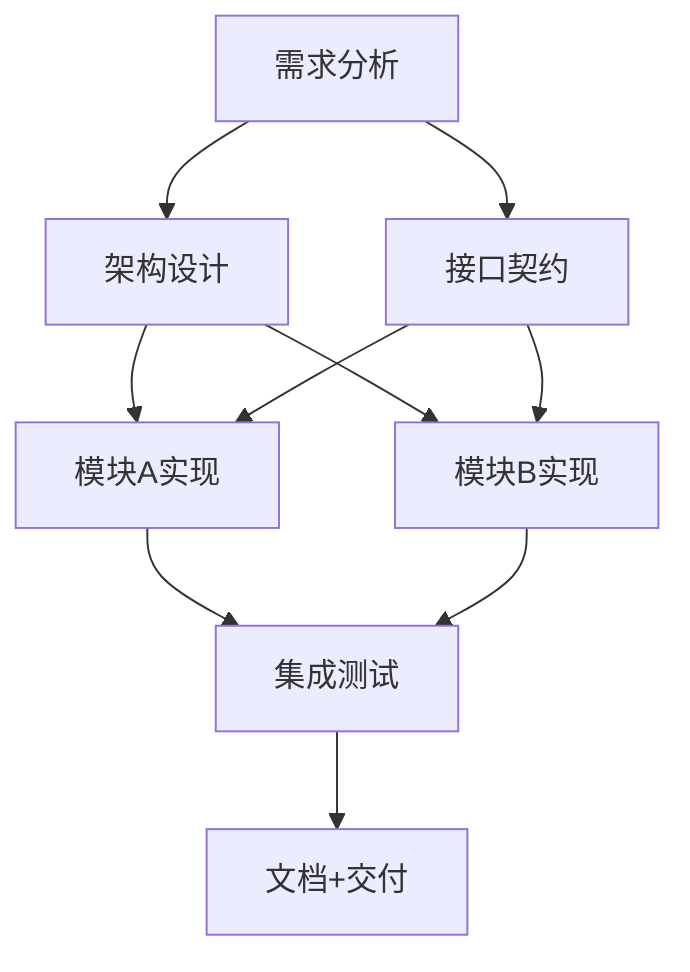

# Theatre — 图结构工作流系统 可行性分析

> 将现有的硬编码三阶段 SwarmRunner 泛化为用户可定义的图结构工作流引擎。
> 现有三阶段是一张内置图，名为 `theatre`。

---

## 1. 概念模型

### 1.1 用户视角

用户用 Mermaid-like DSL 描述一张 **工作流图**：



每个节点附带详细说明，最终形成一个 `.stp/graph/theatre.graph.yaml` 文件：

```yaml
# .stp/graphs/auth-refactor.graph.yaml
name: auth-refactor
description: "重构认证系统，分离JWT逻辑，增加OAuth2支持"
version: 1

nodes:
  # -------- Node 1 --------
  analyze:
    label: "需求分析 + 代码审计"
    description: |
      通读当前 src/auth/ 下所有文件，输出：
      1. 现有架构图 (mermaid)
      2. 问题列表 (安全性、可维护性、扩展性)
      3. 重构建议优先级排序
    role: architect
    tools: [read, grep, glob, web_search, write]
    outputs:
      - type: file
        path: docs/audit-report.md
    gate:
      type: human-review
      prompt: "请审阅审计报告，确认重构范围"
      options: [确认范围, 缩小范围, 取消]
    timeout: 30m

  # -------- Node 2 --------
  contract-design:
    label: "接口契约设计"
    description: |
      基于审计报告，设计新的认证接口：
      1. TokenProvider 接口 (issue, verify, refresh, revoke)
      2. AuthMiddleware 接口
      3. UserIdentity 类型定义
      输出 TypeScript 接口和类型到 src/auth/types.ts
    depends_on: [analyze]
    role: typescript-architect
    tools: [read, write, edit, grep]
    outputs:
      - type: file
        path: src/auth/types.ts
    gate:
      type: compile-check
      command: "bun check src/auth/types.ts"

  # -------- Node 3 --------
  jwt-impl:
    label: "JWT 实现"
    description: |
      实现 JwtTokenProvider，满足 TokenProvider 接口
      文件: src/auth/providers/jwt.ts
      要求:
      - RS256 签名
      - 自动 key rotation
      - refresh token 与 access token 分离
      - 单元测试覆盖 ≥ 90%
    depends_on: [contract-design]
    role: backend-implementer
    tools: [read, write, edit, grep, bash]
    heavy: true              # ← 标记为重型节点，允许 agent fork
    outputs:
      - type: file
        path: src/auth/providers/jwt.ts
      - type: file
        path: src/auth/__tests__/jwt.test.ts
    gate:
      type: test
      command: "bun test src/auth/__tests__/jwt.test.ts"

  # -------- Node 4 --------
  oauth2-impl:
    label: "OAuth2 实现"
    description: |
      实现 OAuth2Provider，支持:
      - GitHub OAuth
      - Google OAuth
      - 通用 OIDC
      文件: src/auth/providers/oauth2.ts
    depends_on: [contract-design]
    role: backend-implementer
    tools: [read, write, edit, grep, bash]
    heavy: true
    outputs:
      - type: file
        path: src/auth/providers/oauth2.ts
      - type: file
        path: src/auth/__tests__/oauth2.test.ts
    gate:
      type: test

  # -------- Node 5 --------
  integration-test:
    label: "集成测试"
    description: |
      编写端到端认证流程测试
    depends_on: [jwt-impl, oauth2-impl]
    role: tester
    tools: [read, write, bash, grep]
    outputs:
      - type: file
        path: src/auth/__tests__/integration.test.ts
    gate:
      type: test

  # -------- Node 6 --------
  docs-deliver:
    label: "文档 + 交付"
    description: |
      更新 API 文档，写迁移指南，写 CHANGELOG
    depends_on: [integration-test]
    role: documenter
    tools: [read, write, grep]
    outputs:
      - type: file
        path: docs/auth-migration.md
      - type: file
        path: CHANGELOG.md
    gate:
      type: human-review
      prompt: "最终交付审核"
      options: [通过, 需要修改]
```

### 1.2 系统视角：Graph Runner

系统将这张图编译成可执行的状态机：

```
┌─────────────────────────────────────────────────────────────────┐
│                      GraphRunner                                │
│                                                                 │
│  ┌──────────┐   ┌──────────────┐   ┌─────────────────────────┐ │
│  │ Graph    │──▶│ DAG Builder  │──▶│ Node Executor            │ │
│  │ Parser   │   │ (toposort)   │   │ ┌───────┐ ┌───────┐     │ │
│  └──────────┘   └──────────────┘   │ │ Agent  │ │ Agent  │ ... │ │
│                                    │ │ Per N │ │ Per N │     │ │
│  ┌──────────┐   ┌──────────────┐   │ └───────┘ └───────┘     │ │
│  │ Role     │──▶│ Agent        │   └─────────────────────────┘ │
│  │ Resolver │   │ Assembler    │                                │
│  └──────────┘   └──────────────┘   ┌─────────────────────────┐ │
│                                    │ Gate Checker            │ │
│  ┌──────────┐   ┌──────────────┐   │ (compile/test/human)    │ │
│  │ Lesson   │◀──│ Curtain per  │   └─────────────────────────┘ │
│  │ Extractor│   │ Graph        │                                │
│  └──────────┘   └──────────────┘                                │
└─────────────────────────────────────────────────────────────────┘
```

---

## 2. 可行性分析：逐层对照

### Layer 1: Graph DSL 解析 → ❓ 部分存在

**需要新建**：Graph YAML parser + validator

| 能力 | 现有资产 | 差距 |
|------|---------|------|
| YAML 解析 | `Bun.YAML.parse()` (swarm-cli.ts 已用) | ✅ 零成本 |
| Schema validation | `parseSwarmYaml()` / `validateSwarmDefinition()` in `core/schema.ts` | 🟡 需要新增 graph schema |
| DAG 构建 | `buildDependencyGraph()` + `buildExecutionWaves()` + `detectCycles()` in `core/dag.ts` | ✅ 直接复用 |
| Mermaid 解析 | 无 | 🔴 需要新建 mermaid → graph YAML 的编译器 |

**Mermaid → Graph YAML 编译器的设计**：

```typescript
// packages/coding-agent/src/graph/mermaid-compiler.ts

/**
 * Compile a Mermaid flowchart into a Theatre graph definition.
 * 
 * Supports:
 *   flowchart TD / LR
 *   node labels: A[Node Name]
 *   edges: A --> B  (simple dependency)
 *   edge labels: A -->|"合约"| B  (styled dependency with contract)
 *   subgraphs: subgraph Phase1 ... end  (phase grouping)
 */
export function compileMermaidToGraph(mermaid: string): GraphDefinition {
  // 1. Lex/parse Mermaid syntax
  // 2. Extract nodes + edges
  // 3. Infer dependencies (A --> B means B depends_on A)
  // 4. Group by subgraph → phases
  // 5. Generate node stubs (user fills in details later)
}

// Usage:
// stp graph compile ./docs/workflow.mermaid
// → outputs .stp/graphs/workflow.graph.yaml (stub)
// user fills in role, description, gate for each node
```

结论：Mermaid 解析器需要新建（~200行），但 DAG 基础设施完全复用，整体可行。

---

### Layer 2: State Machine Construction → ✅ 高度可行

**关键洞察**：不需要新建状态机。`WorkflowFSM` 已经是通用的 phase 状态机。

当前架构：

```
PHASES = [idle, script, script-debate, script-confirm, stage, paused, blocked, curtain]
```

这是**硬编码的 8 个 phase**。对于 Theatre graph，我们需要的不是修改 PHASES 列表，而是**让 WorkflowFSM 的 phase 由节点的执行状态动态决定**。

**架构方案**：在 `WorkflowFSM` 之上加一层 `GraphFSM`：

```typescript
// packages/coding-agent/src/graph/graph-fsm.ts

export class GraphFSM {
  #graph: GraphDefinition;
  #waves: string[][];           // topological sort result
  #currentWave: number = 0;
  #nodeStates: Map<string, NodeState>;
  #fsm: WorkflowFSM;           // reuse existing
  #stateTracker: StateTracker;

  // Current phase maps to a WorkflowFSM Chapter:
  // idle      → before start
  // stage     → executing nodes (waves)
  // paused    → gate waiting for human
  // blocked   → node failed, needs intervention
  // curtain   → all nodes done, running reflection
  // idle      → complete
}
```

**状态映射**：

```
User Graph Phase     →  WorkflowFSM Chapter
───────────────────────────────────────────
初始化/解析          →  idle → stage (跳过script因为图已定义)
Wave 0 执行中        →  stage
Gate 等待人工确认     →  paused
Node 失败无法自动修复  →  blocked
所有 nodes 完成       →  curtain
Curtain 完成          →  idle
```

关键：WorkflowFSM 的 `transition()` / `force()` API 完全够用。不需要改 FSM 本身，只需要在 GraphFSM 中正确调用。

结论：✅ 完全可行。WorkflowFSM 已经足够，只需建适配层。

---

### Layer 3: Per-Node Persistent Agent → 🟡 部分存在

**核心需求**：每个 graph node 分配一个持久化 agent，有记忆，有身份。

**现有资产**：

| 组件 | 状态 | 功用 |
|------|------|------|
| `AgentProfile` | ✅ 已有 | 跨 run 持久身份 (identity, expertise, credit, social, stats) |
| `ProfileRegistry` | ✅ 已有 | Profile CRUD, 持久化到 `.stp/profiles/` |
| `AgentRegistry` | ✅ 已有 | 在内存中 track 所有活跃 agent, 支持 `register({ kind: "persistent" })` |
| `AgentLifecycleManager` | ✅ 已有 | park/wake/revive agent |
| `RoleAssetManager` | ✅ 已有 | 从 `.swarm-workspace/roles/` 加载角色定义 |
| `RoleProvider` | ✅ 已有 | 解析 role name → systemPrompt + tools + guidelines |
| `AgentRuntime.spawn()` | ✅ 已有 | 创建 Agent 实例并返回 AgentHandle |

**差距分析**：

```
graph node → agent 的完整链路:

1. node.role → RoleProvider.resolve(role) → ResolvedRole
   ✅ 已存在

2. 如果 role 不存在 → 根据 node.description 自动生成 RoleAsset
   🔴 需要新建: RoleSynthesizer

3. 创建 AgentProfile (如果该 role 的 agent 第一次被使用)
   🟡 部分存在: ProfileRegistry.register() 可创建, 但缺少 "根据 role 自动初始化 expertise domain"

4. AgentRuntime.spawn() 启动 agent，注入 node.task
   ✅ 已存在

5. 执行完成后，agent 保持持久化 (park, 不销毁)
   ✅ AgentLifecycleManager.park() 已存在

6. 下次同一个 graph node 再次执行，revive 同一个 agent
   ✅ AgentLifecycleManager.wake() 已存在
```

**需要新建的核心组件**：`RoleSynthesizer`

```typescript
// packages/coding-agent/src/graph/role-synthesizer.ts

export class RoleSynthesizer {
  /**
   * Given a node's description and required tools, synthesize a RoleAsset.
   * 
   * Strategy:
   * 1. Search existing roles for semantic similarity (embedding match)
   * 2. If close match found (cosine > 0.8): clone + adapt
   * 3. If no match: generate new role from description
   * 4. Write to .swarm-workspace/roles/{role-id}.role.yaml
   * 5. Mark as "proposed" (not "approved" — needs first successful run)
   */
  async synthesize(node: GraphNode): Promise<RoleAsset> {
    // 1. Search existing roles
    const candidates = await this.roleAssetManager.search({
      tag: node.tools.join(","),
      // future: semantic search via embeddings
    });

    // 2. If close match, clone
    if (candidates.length > 0 && candidates[0].usage_count > 5) {
      return this.cloneAndAdapt(candidates[0], node);
    }

    // 3. Generate new
    return this.generateRole(node);
  }
}
```

结论：🟡 关键组件 AgentProfile + ProfileRegistry + RoleProvider + AgentRuntime 都已存在。RoleSynthesizer 需要新建 (~150行)。整体可行。

---

### Layer 4: Fork for Heavy Nodes → ✅ 已有

`agent_fork` 工具已实现：

- `AgentForkTool` (`tools/agent-fork-tool.ts`) — LLM 可调用的 fork 工具
- `AgentForkManager` (`agent/agent-fork-manager.ts`) — 深 fork + 子任务分配 + 结果合并
- 支持 `reason`, `count` (max 4), `task` 参数
- Fork 出的子 agent 继承父 agent 上下文
- 深度限制: fork → children (depth=1)，子 agent 不可再 fork

在 graph node 中使用：
```
node 标记 `heavy: true`
→ GraphRunner 在启动 agent 时注入 fork 能力
→ agent 评估工作量，如果太大则调用 agent_fork
→ 子 agent 并行完成，结果合并回父 agent
→ 父 agent 整理结果并提交
```

结论：✅ 直接可用。只需在 node executor 中根据 `heavy: true` 启用 fork 工具。

---

### Layer 5: Gate Validation → 🟡 部分存在

| Gate 类型 | 实现 | 状态 |
|-----------|------|------|
| `compile-check` | `bash("bun check")` | ✅ 通过 bash 工具 |
| `test` | `bash("bun test ...")` | ✅ 通过 bash 工具 |
| `lsp` | `lsp diagnostics` 工具 | ✅ 已有工具 |
| `human-review` | Prompt + dialog | 🔴 需要 gate controller |

**Gate Controller** 设计：

```typescript
// packages/coding-agent/src/graph/gate-controller.ts

export interface GateSpec {
  type: "compile-check" | "test" | "lsp" | "human-review" | "script";
  command?: string;          // for script type
  prompt?: string;           // for human-review
  options?: string[];        // for human-review choices
  timeout?: string;          // auto-advance timeout
}

export class GateController {
  /**
   * Run the gate for a completed node.
   * Returns GateResult — ok or failed with reason.
   */
  async runGate(node: GraphNode, agentOutput: string): Promise<GateResult> {
    switch (node.gate.type) {
      case "compile-check":
        return this.runCompileCheck(node.gate.command!);
      case "test":
        return this.runTest(node.gate.command!);
      case "lsp":
        return this.runLsp(node.outputs);
      case "human-review":
        return this.awaitHumanDecision(node.gate.prompt!, node.gate.options!);
      case "script":
        return this.runScript(node.gate.command!);
    }
  }

  /**
   * If gate fails, decide: retry, fix-up agent, or block.
   */
  async handleGateFailure(node: GraphNode, result: GateResult): Promise<GateAction> {
    // P0: if transient (test flake) → retry up to 3 times
    // P1: if fixable → spawn fix-up agent
    // P2: if unfixable → block + notify human
  }
}
```

结论：🟡 Gate 执行机制大部分可复用现有 bash/lsp 工具。需要新建 GateController (~100行) 统一 gate 执行 + 失败处理。

---

### Layer 6: Curtain (Lesson Extraction + Role Refinement) → ✅ 80% 已有

**CurtainRunner 现有的能力**：

| 步骤 | 实现 |
|------|------|
| Reporter agent 总结 | `CurtainRunner`: Thread A — reporter agent 生成交付总结 |
| Reflection agents 提取经验 | `CurtainRunner`: Thread B — reflection agents 提取 lessons |
| Lesson 持久化 | `ExperienceStore`: lessons.jsonl + FTS5 index |
| 语义记忆 | `MnemopiAdapter`: 写入 Mnemopi |
| 跨 session 经验 | `HindsightAdapter`: 推送到 Hindsight |

**需要新增的**：Role Refinement (从经验反馈到 RoleAsset 更新)

```typescript
// packages/coding-agent/src/graph/role-refiner.ts

export class RoleRefiner {
  /**
   * After Curtain, analyze lessons and update roles.
   * 
   * For each role used in this graph run:
   * 1. Extract lessons relevant to this role
   * 2. Update role.success_rate based on node outcomes
   * 3. If success_rate dropped below threshold → propose role revision
   * 4. Add new guidelines from lessons
   * 5. Update expertise.proficiency for domains worked on
   */
  async refineFromRun(
    roles: RoleAsset[],
    nodeResults: Map<string, NodeResult>,
    lessons: ExtractedLesson[]
  ): Promise<RoleRefinement[]> {
    // ...
  }
}
```

结论：🟡 Curtain 基础设施已完善。Role Refinement 需要新建 (~120行)。整体可行。

---

### Layer 7: TUI Integration → ✅ 可复用

| TUI 需求 | 现有组件 |
|-----------|---------|
| Graph 可视化 (节点+边状态) | `SwarmDashboard` 的 PhaseView 已展示 phase bar；需要泛化为 graph view |
| Node 进度追踪 | `AgentPanel` 已展示 agent 状态；直接映射到 node 状态 |
| Gate 等待提示 | `PlanReviewOverlay` 已有人工审核 overlay；复用 human-review gate |
| Steering | `SwarmTuiBinding` + CommBus 已有；路由到当前 active node 的 agent |

需要新建：`GraphView` 组件 (~200行)，在 dashboard 中绘制 Mermaid-like 的节点状态图。

---

### Layer 8: "theatre" as Built-in Graph → ✅ 简单

将现有三阶段定义为一张内置 graph：

```yaml
# .stp/graphs/builtin/theatre.graph.yaml
name: theatre
description: "SatoPi 内置三阶段工作流：Script → Stage → Curtain"
version: 1
builtin: true   # ← 标记为内置，不可删除

nodes:
  script:
    label: "Script · 需求规划"
    description: |
      与用户对话，澄清需求，产出 plan.md
    role: planner
    tools: [read, grep, glob, write, todo, agent_ask, web_search]
    outputs:
      - type: file
        path: plan.md
    gate:
      type: human-review
      prompt: "Plan 已完成，是否确认并进入执行阶段？"
      options: [确认执行, 修正计划, 取消]
    timeout: 0  # no auto-advance

  stage:
    label: "Stage · 并行执行"
    description: |
      解析 plan.md → DAG TaskQueue，分 wave 并行派发 workers
    depends_on: [script]
    role: stage-controller
    tools: [task, irc, todo, bash, read, write]
    heavy: true
    gate:
      type: compile-check
      command: "bun check && bun test"

  curtain:
    label: "Curtain · 收尾反思"
    description: |
      Reporter 总结交付，Reflector 提取经验
    depends_on: [stage]
    role: reflector
    tools: [read, write, todo, bash]
    gate:
      type: human-review
      prompt: "最终交付完成，请 Applaud"
      options: [Applaud, 需要修改]
```

这样用户就可以：
1. 直接使用内置 `theatre` 图（相当于现在的 magic keyword "swarm"）
2. 或者自定义自己的图（`stp graph run my-workflow.graph.yaml`）
3. 甚至扩展 `theatre`（增加更多 phase）

---

## 3. 实现路径和工程量估算

### Phase A: Graph Core (~800行新代码)

| 文件 | 行数 | 功能 |
|------|------|------|
| `graph/schema.ts` (新) | ~150 | GraphDefinition, GraphNode, GateSpec types + YAML parser |
| `graph/graph-fsm.ts` (新) | ~150 | GraphFSM: 将 graph → WorkflowFSM phase 映射 |
| `graph/graph-runner.ts` (新) | ~200 | 核心引擎: parse graph → build DAG → execute waves → run curtain |
| `graph/node-executor.ts` (新) | ~150 | 执行单个 node: resolve role → spawn agent → wait → run gate |
| `graph/gate-controller.ts` (新) | ~150 | Gate 执行 + 失败处理 (retry/fix-up/block) |

### Phase B: Role & Agent (~400行新代码)

| 文件 | 行数 | 功能 |
|------|------|------|
| `graph/role-synthesizer.ts` (新) | ~150 | 从 node 描述生成 RoleAsset |
| `graph/role-refiner.ts` (新) | ~150 | 从 Curtain lessons 更新 RoleAsset |
| `agent/role-asset.ts` (修改) | ~50 | 增加 `created_by: "synthesizer"` / `derived_from: "role-id"` 字段 |
| `agent/agent-profile.ts` (修改) | ~50 | 增加 `graphId` / `nodeId` 到 identity 中 |

### Phase C: Mermaid Compiler (~300行新代码)

| 文件 | 行数 | 功能 |
|------|------|------|
| `graph/mermaid-compiler.ts` (新) | ~200 | Mermaid flowchart → GraphDefinition |
| `graph/mermaid-compiler.test.ts` (新) | ~100 | 测试各种 mermaid 语法 |

### Phase D: TUI (~300行新代码)

| 文件 | 行数 | 功能 |
|------|------|------|
| `modes/components/swarm/graph-view.ts` (新) | ~200 | 图可视化组件 (节点+状态+边) |
| `modes/components/swarm/swarm-dashboard.ts` (修改) | ~50 | 集成 graph view |
| `modes/interactive-mode.ts` (修改) | ~50 | graph 模式开关 |

### Phase E: Builtin Theatre Graph (~100行)

| 文件 | 行数 | 功能 |
|------|------|------|
| `.stp/graphs/builtin/theatre.graph.yaml` (新) | ~80 | 内置三阶段图 |
| `graph/builtin-registry.ts` (新) | ~20 | 注册内置图 |

### 总计

| 阶段 | 新增 | 修改 | 合计 |
|------|------|------|------|
| A: Graph Core | 800 | 0 | 800 |
| B: Role & Agent | 300 | 100 | 400 |
| C: Mermaid | 300 | 0 | 300 |
| D: TUI | 200 | 100 | 300 |
| E: Builtin | 100 | 0 | 100 |
| **总计** | **1700** | **200** | **~1900** |

---

## 4. 关键设计决策

### 4.1 每个 Node 一个 Agent vs 每个 Node 一类 Agent

**推荐**：每个 node **类型** (role) 对应一个 AgentProfile，每个 run 创建一个临时 Agent 实例。

理由：
- AgentProfile 积累跨 run 的经验（credit, stats, expertise）
- 每次 run 的 Agent 实例是 fresh context（不携带上次 run 的消息历史）
- park/wake 机制保留但不强制复用（agent 太忙时可以 spawn 新实例）

### 4.2 Graph 版本管理

Graph 本身应视为代码，纳入版本管理：

```
.stp/graphs/auth-refactor.graph.yaml  → git tracked
.stp/graphs/auth-refactor.v2.graph.yaml  → 新版本
```

每次 graph 更新，旧版本的 node→agent 映射仍然有效（profile 按 role name 匹配，跨 graph version）。

### 4.3 Node 间数据流

Node 的 output 如何传递给下游 node？

**方案**：通过文件系统 + plan.md artifact。

```
Node A 输出 docs/audit-report.md
  → Node B 的 agent prompt 中包含:
    "上游 node 'analyze' 已产出: docs/audit-report.md.
     其内容摘要如下: ... (前500字)。完整内容请用 read 工具查看。"
```

这与 SwarmRunner 当前的 inter-wave data flow 一致（`pipeline.ts` 的 `WaveResult` → 下游 agent 注入）。

### 4.4 与 Magic Keyword 的融合

```
用户输入 "swarm"           → 触发内置 theatre graph
用户输入 "/graph run X"    → 触发自定义 graph
用户输入 "/graph compile"  → Mermaid → graph 编译
用户输入 "swarm X"         → 如果 .stp/graphs/X.graph.yaml 存在，用 X；否则用 theatre
```

---

## 5. 风险评估

| 风险 | 概率 | 影响 | 缓解 |
|------|------|------|------|
| Mermaid 语法太灵活，编译不完整 | 中 | 编译失败或语义错误 | 只支持 flowchart TD 子集；其余报友好错误 |
| RoleSynthesizer 生成的 role 质量差 | 中 | agent 行为不符合预期 | 先用现有 role 匹配；只有 close match 才 clone；generated role 标记为 "proposed" |
| DAG 死锁 (循环依赖) | 低 | 图无法执行 | `detectCycles()` 已实现，在图加载时就拒绝 |
| Agent fork 导致 token 爆炸 | 高 | 成本过高 | `heavy: true` 是显式 opt-in；默认不 fork；可以设置 per-run token cap |
| 持久化 agent park/wake 内存泄漏 | 低 | 系统资源耗尽 | AgentLifecycleManager 已有 idle timeout；park 超时的 agent 自动 dispose |

---

## 6. 结论

**完全可行。**

核心发现：

1. **不需要建新的状态机**。`WorkflowFSM` 的通用 phase 模型（idle → executing → paused/blocked → curtain → idle）直接映射到任意 DAG 的执行生命周期。只需 GraphFSM 做适配。

2. **80% 的基础设施已经在**。`AgentProfile`, `ProfileRegistry`, `RoleProvider`, `AgentRuntime.spawn()`, `WorkflowFSM`, `buildExecutionWaves()`, `detectCycles()`, `TaskQueue`, `CurtainRunner`, `ExperienceStore` 都是现成的。

3. **只需要三个新组件**：
   - `RoleSynthesizer` — 从 node 描述生成角色
   - `GraphRunner` — 图执行引擎
   - `MermaidCompiler` — Mermaid → graph YAML
   
   其余全是 wiring 和 TUI 适配。

4. **Theatre 只是一张 YAML 文件**。现有的硬编码三阶段变成 `.stp/graphs/builtin/theatre.graph.yaml`，与用户的图共享同一套 GraphRunner 引擎。

5. **工程量：~1900 行**。对于一个已经拥有 `SwarmRunner`、`WorkflowFsm`、`AgentRuntime`、`CurtainRunner` 的系统来说，这是非常合理的增量。
