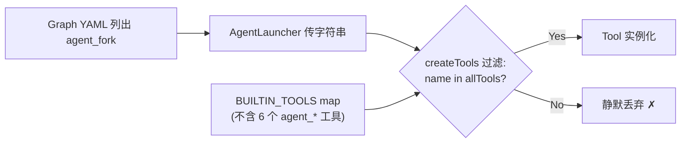

# 迁移方案论证报告

> 对 `/root/.codebuddy-server-cn/data/User/globalStorage/tencent-cloud.coding-copilot/plans/138ef236dd7f4394a3d63fddb1b36723/plan.md` 的多 Agent 交叉验证结论

---

## 用户问题回答

### Q1: agent-channel-tools.ts 注册的 tools 能否全局使用？

**不能。** 5 个 channel 工具（`agent_broadcast` / `agent_query_all` / `agent_query_majority` / `agent_roundtable` / `agent_peers`）和 1 个 fork 工具（`agent_fork`）均 **不在 `BUILTIN_TOOL_NAMES`** 中。`createTools()` 在 `tools/index.ts:660-661` 通过 `name in allTools` 过滤工具名，未知名称被 **静默丢弃**（无错误、无警告）。



**这意味着：** `theatre.graph.yaml` 中引用的 `agent_fork` **从未正常工作过**——它被静默过滤，agent 永远看不到这个工具。

### Q2: IrcBus 和 channel tools 的关系是什么？

| 层级 | 组件 | 职责 |
|------|------|------|
| L0 | `IrcBus`（`src/irc/bus.ts`） | 进程级单例 mailbox bus，提供 `send`/`wait`/`inbox`。持有 `#activityLogger`、`#hookPipeline`、`#channels` |
| L1 | `CommChannel`（`src/swarm/comm-bus/`） | IrcBus 的上层封装，提供 `broadcast`/`queryAll`/`roundtable`/`vote` |
| L2 | Agent Tools（`agent-channel-tools.ts`） | LLM 可调用的 5 个工具，通过 `resolveChannel()` 获取 CommChannel |

`resolveChannel()` 的 fallback 路径（line 57-66）：
1. 优先从 `AgentToolContext.commChannel` 获取
2. Fallback：从 `IrcBus.global()` 创建空 CommChannel（0 member）

**问题：** fallback 路径是死代码——因为工具本身从未被 `createTools()` 实例化，`resolveChannel()` 永远不会被调用。

### Q3: Persistent agent 是否具有这些工具？

**不具有。** Persistent agent 的工具获取流程：

```
agent_invoke tool → createAgentSession() → createTools(toolNames)
                                              ↓
                                     toolNames 来自 AgentProfile
                                     → RoleProvider.resolveFromProfile()
                                     → 只能解析 BUILTIN_TOOLS 中的工具
```

即使 persistent agent 的 profile 明确请求 `agent_broadcast`，`createTools()` 也会在过滤阶段丢弃它（因为不在 `allTools` 中）。

**Step 10 即使补全了 IrcBus wiring，也无法改变这一事实。** IrcBus wiring 只影响 IrcBus 自身的行为（消息 relay、hook 触发），不影响工具注册。

### Q4: agent-fork-tool.ts 的现状？

`AgentForkTool` 类（`tools/agent-fork-tool.ts:46`）：
- ✅ 实现完整：schema 定义、execute 逻辑、`AgentForkManager` 集成
- ✅ 被 YAML 引用：`theatre.graph.yaml:68` 和 `DEFAULT_STAGE_TOOLS`（`loop-converter.ts:37`）
- ❌ 未注册：不在 `BUILTIN_TOOLS` / `BUILTIN_TOOL_NAMES`
- ❌ 未实例化：全代码库无 `new AgentForkTool()` 调用
- ❌ 运行时静默失败：tool name string 被 `createTools()` 过滤丢弃

**结论：agent_fork 是一个"幽灵工具"**——YAML 声明它存在，LLM 可能被提示调用它，但它从未被实际注入到 agent 的工具集中。

---

## 方案真实性评估

### 文件路径 ✅ 全部正确

| 组件 | 源路径 | 状态 | 文件数匹配 |
|------|--------|------|-----------|
| Chapter 类型 | `swarm/core/state.ts:39` | ✅ | 1 |
| pipeline-types | `swarm/core/pipeline-types.ts` | ✅ | 1 |
| HookPipeline | `swarm/hook-system/` | ✅ | 10 |
| ActivityLogger | `swarm/infra/activity-logger.ts` | ✅ | 1 |
| CommChannel | `swarm/comm-bus/` | ✅ | 5 |
| ExperienceStore | `swarm/curtain/experience.ts` + `extractor.ts` | ✅ | 2 |
| ContextPipeline | `swarm/context-manager/` | ✅ | 12 |

所有目标目录均不存在，需新建。依赖拓扑验证正确。

### 数字准确性 ❌ 多处夸大

| 指标 | 方案声称 | 实际值 | 偏差 |
|------|---------|--------|------|
| ActivityLogger 引用数 | 85+ | ~29 | **3× 夸大** |
| src/ 顶层需更新文件 | 24 | 12 | **2× 夸大** |
| ActivityLogger 外部引用 | 16 | 4 | **4× 夸大** |
| Swarm 内部 import | 61+ | ~80（含遗漏的 7 个） | 接近但遗漏了 curtain/ 内部 import |

### 事实错误

1. **方案 Step 9 声称** `src/tools/agent-channel-tools.ts` 需要从 hook-system 更新 import 路径。**实际：** `agent-channel-tools.ts` 不导入 hook-system——它只导入 `CommChannel` 和 `ActivityLogger`。

---

## 方案可行性评估

### Steps 1-7（文件迁移）: 可执行 ✅⚠️

| Step | 风险 | 问题 |
|------|------|------|
| 1 (Chapter) | **低** | 无 |
| 2 (pipeline-types) | **低** | 遗漏了 `src/offload/hooks.ts` 的显式列出 |
| 3 (HookPipeline) | **中** | 25 个文件需更新，体积大但机械 |
| 4 (ActivityLogger) | **高** | 数字虚高导致执行者浪费时间；`package.json` export path 遗漏 |
| 5 (ExperienceStore) | **中** | **遗漏了 7 个 curtain/ 内部 import**（见下文） |
| 6 (CommChannel) | **低** | 11 个文件，路径简单 |
| 7 (ContextPipeline) | **中** | 14 个文件，无外部引用 |

### Step 8-9（批量 import 更新）: 有遗漏 ⚠️

**7 个遗漏的 import 路径更新（5 个文件）：**

| 文件 | 当前 import | 迁移后应为 |
|------|-----------|-----------|
| `swarm/curtain/reflector.ts` | `from "./extractor"` | `from "../../experience/extractor"` |
| `swarm/curtain/summarizer.ts` | `from "./extractor"` | `from "../../experience/extractor"` |
| `swarm/curtain/lesson-sink.ts` | `from "./extractor"` | `from "../../experience/extractor"` |
| `swarm/curtain/lesson-sink.ts` | `from "./experience"` | `from "../../experience/experience"` |
| `swarm/curtain/index.ts` | `from "./extractor"` | `from "../../experience/extractor"` |
| `swarm/curtain/index.ts` | `from "./experience"` | `from "../../experience/experience"` |
| `swarm/infra/index.ts` | `from "./activity-logger"` | `from "../../infra/activity-logger"` |

**根因：** Step 8 的搜索模式只覆盖跨目录 import（`from "../..."`），未覆盖同目录 import（`from "./..."`）。

**额外遗漏：** `package.json` 中的 `"./swarm/activity-logger"` export path 迁移后失效。

### Step 10（IrcBus wiring）: ❌ 阻塞

**4 个致命缺陷使 Step 10 无法实现其声称的目标：**

| 缺陷 | 详情 |
|------|------|
| **Singleton 冲突** | `IrcBus.global()` 是单例。`assembler.ts:192-194` 和 `createAgentSession()` 都会调用 `setActivityLogger`/`setHookPipeline`——后者覆盖前者。缺少 `setIfAbsent` 守卫。 |
| **工具未注册** | 6 个 agent 工具不在 `BUILTIN_TOOLS` 中。IrcBus wiring 无法让 agent 调用 `agent_broadcast` 等工具。 |
| **CommChannel 缺失** | persistent agent 的 `AgentToolContext` 中没有 `commChannel`。`resolveChannel()` fallback 创建的是 0-member 空 CommChannel——工具调用静默成功但"发送到 0 个 agent"。 |
| **AgentRuntime 引用缺失** | `agent_invoke` 需要 `AgentRuntime` 来 spawn 子 agent 并注入完整上下文。当前 session factory 不传递此引用。 |

**Step 10 即使执行，实际效果仅限于**："IrcBus 能记录自己的 IRC 流量日志"——远未达到"persistent agent 和 task sub-agent 能使用 CommChannel"的目标。

---

## 圆桌辩论结论

| 角色 | 方案评分 | 核心立场 |
|------|---------|---------|
| **Architect** | 90% 正确 | 拓扑正确，缺口是 minor fixes + out-of-scope |
| **Skeptic** | 需大改 | 数字虚高是 credibility 问题；7 个遗漏 import + 工具幽灵是 blocker |
| **Implementer** | Steps 1-9 可修；Step 10 阻塞 | 最大风险是虚高数字浪费执行时间 + package.json 遗漏 |
| **Integrator** | Step 10 不达目标 | 方案声称的目标（persistent agent 使用 CommChannel）需要 4 个额外前提条件 |

### 共识点
- **拓扑正确**：4 人一致同意依赖拓扑和迁移顺序正确
- **文件选择正确**：7 组组件的源/目标路径无误
- **Step 10 不足**：4 人一致认为 Step 10 不足以实现目标

### 分歧点
- **数字夸大是否算 blocker**：Architect 认为"保守估算无妨"，Skeptic/Implementer 认为"3× 误差是 credibility 问题"
- **工具注册缺口是否属于本方案范围**：Architect 认为"独立工作项"，Integrator 认为"方案 Step 10 目标依赖它"

---

## 修正建议

### 必须修复（执行前）

1. **更正 import 计数**：ActivityLogger ~29（非 85+），src/ 文件 12（非 24）
2. **修正事实错误**：删除对 `agent-channel-tools.ts` 导入 hook-system 的错误声明
3. **补充 7 个遗漏的 import 更新**：`swarm/curtain/` 和 `swarm/infra/index.ts` 的同目录 import
4. **补充 `package.json` export path 更新**
5. **IrcBus 添加 `setIfAbsent` 守卫**，避免 singleton 覆盖

### 强烈建议（执行前或同步）

6. **将 6 个 agent 工具注册到 BUILTIN_TOOLS**：使用 `createIf` 模式（仿 `IrcTool.createIf`），仅在 swarm context 存在时激活
7. **Step 10 拆分为两个子步骤**：
   - 10a：IrcBus 全局 wiring（带 `setIfAbsent`）——实现 IrcBus 自身功能
   - 10b：工具注册 + CommChannel 注入 + AgentRuntime 引用——实现 agent 可用

### 后续工作

8. **修复 `agent_fork` 幽灵工具**：要么注册到 BUILTIN_TOOLS，要么从 `theatre.graph.yaml` 和 `DEFAULT_STAGE_TOOLS` 中移除

---

## 最终结论

**方案的真实性：** 文件路径和依赖拓扑 100% 正确。但 import 计数被系统性夸大（3×），且有一处事实错误。

**方案的可行性：** Steps 1-9 在修正 7 个遗漏 import + package.json 后可执行。Step 10 需拆分和补充 4 个前提条件。

**推荐行动：** 先修正上述 "必须修复" 的 5 项，然后执行 Steps 1-9。Step 10 重新设计后再执行。
